# Day 10: Object-Relational Mapping (ORM) with JPA, Hibernate 6 & Entity Relationships

---

## 1. Quick Start: Running & Testing Today's Application

### Start the Server:
In your terminal, run:

```bash
mvn clean package
mvn jetty-ee10:run
```

### URLs to Open in Your Browser:
1. **Application Home:** [http://localhost:8081/](http://localhost:8081/)
2. **Students & Departments Hub:** [http://localhost:8081/students](http://localhost:8081/students)
3. **Add Student Form:** [http://localhost:8081/student.html](http://localhost:8081/student.html)

> **Port Note:** The server is configured on port **`8081`** in `pom.xml`.

---

## 2. The Big Picture: Why JPA & Hibernate?

### Real-World Analogy: The Automated Translator 🌐
* **In Day 8 (JDBC):** You were a manual builder. Every single database query required writing raw SQL strings (`"INSERT INTO students (name, department, age) VALUES (?, ?, ?)"`), mapping every column manually from `ResultSet`, and managing SQL connections by hand.
* **In Day 10 (JPA & Hibernate):** You hire an automated translator (**Hibernate**). You just talk in Java objects (`student.setName("Alice")`), and Hibernate automatically speaks PostgreSQL behind the scenes, creating and running SQL queries for you!

```
┌────────────────────────────────────────────────────────────────────────────────────────┐
│                                 DAY 10 MVC ARCHITECTURE                                 │
├───────────────────────┬───────────────────────────┬────────────────────────────────────┤
│ 1. Presentation View  │ 2. Controller & Service   │ 3. Persistence (ORM & Database)    │
│ (JSP, JSTL, HTML)     │ (Servlets & Business Logic│ (JPA, Hibernate 6 & PostgreSQL)    │
├───────────────────────┼───────────────────────────┼────────────────────────────────────┤
│ students.jsp          │ StudentServlet            │ JPAUtil (EntityManagerFactory)     │
│ edit-student.jsp      │ StudentService            │ StudentJPADAO (JPQL & CRUD)        │
│ student.html          │                           │ DepartmentJPADAO (Department CRUD) │
│ index.html            │                           │ PostgreSQL (students, departments) │
└───────────────────────┴───────────────────────────┴────────────────────────────────────┘
```

---

## 3. End-to-End Request Flow (How Data Moves)

Here is exactly what happens when a user visits the application or submits a form:

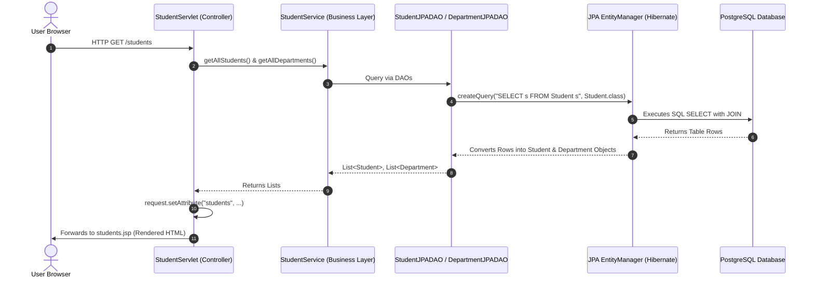

---

## 4. Simple Explanation of Every Implementation

### 📁 1. The Configuration Bridge: `persistence.xml`
* **File Location:** `src/main/resources/META-INF/persistence.xml`
* **What it does:** Tells JPA which database to connect to, which credentials to use, and which Java entity classes exist.
* **Key settings:**
  * `persistence-unit name="campusPU"`: The unique name used by Java code to load these settings.
  * `<class>com.campus.model.Student</class>` and `<class>com.campus.model.Department</class>`: Registers our entity classes with Hibernate.
  * `hibernate.dialect`: Tells Hibernate to speak PostgreSQL syntax.
  * `hibernate.show_sql=true`: Prints the generated SQL queries to your terminal so you can learn what Hibernate is doing.

---

### 📁 2. The EntityManager Factory: `JPAUtil.java`
* **File Location:** `src/main/java/com/campus/util/JPAUtil.java`
* **What it does:** Creates and manages JPA database connections.
* **Why it matters:**
  * `EntityManagerFactory` is heavyweight: Created once when the app starts.
  * `EntityManager` is lightweight: Created per request/transaction and closed immediately after work is done.
```java
// How it is used in code:
EntityManager em = JPAUtil.getEntityManager();
try {
    // perform database operations
} finally {
    em.close(); // always release resources
}
```

---

### 📁 3. Domain Entities & Relationships: `Department.java` & `Student.java`

Instead of storing department as a simple `String`, we model real-world relationships where a Department is its own entity containing multiple students.

#### Department Entity (`Department.java`):
* **One Department has Many Students (`@OneToMany`)**
```java
@Entity
@Table(name = "departments")
public class Department {
    @Id
    @GeneratedValue(strategy = GenerationType.IDENTITY)
    private int id;

    private String name;

    @OneToMany(mappedBy = "department")
    private List<Student> students = new ArrayList<>();
}
```

#### Student Entity (`Student.java`):
* **Many Students belong to One Department (`@ManyToOne`)**
```java
@Entity
@Table(name = "students")
public class Student {
    @Id
    @GeneratedValue(strategy = GenerationType.IDENTITY)
    private int id;

    private String name;
    private int age;

    @ManyToOne
    @JoinColumn(name = "department_id") // Foreign key column in PostgreSQL
    private Department department;
}
```

#### Relationship Concept:
| Annotation | Where It Belongs | What It Means |
|------------|------------------|---------------|
| `@ManyToOne` | `Student.java` | Many students can be enrolled in the same department. |
| `@JoinColumn(name = "department_id")` | `Student.java` | Creates the foreign key column `department_id` in the `students` table. |
| `@OneToMany(mappedBy = "department")` | `Department.java` | One department links back to its list of students. `mappedBy` says `Student.department` owns the relationship. |

---

### 📁 4. The Database Schema: `schema.sql`

```sql
CREATE TABLE departments (
    id SERIAL PRIMARY KEY,
    name VARCHAR(100) NOT NULL
);

CREATE TABLE students (
    id SERIAL PRIMARY KEY,
    name VARCHAR(100) NOT NULL,
    department_id INT,
    age INT,
    CONSTRAINT fk_student_department
        FOREIGN KEY (department_id)
        REFERENCES departments(id)
);
```

---

### 📁 5. Data Access Layer: `StudentJPADAO.java` & `DepartmentJPADAO.java`

These classes handle database transactions without writing low-level JDBC code:

#### The 4 Core JPA Operations:
1. **Create (`persist`)**: Saves a new Java object into PostgreSQL.
   ```java
   em.getTransaction().begin();
   em.persist(student);
   em.getTransaction().commit();
   ```
2. **Read (`find` & `createQuery`)**:
   * Find by ID: `em.find(Student.class, id);`
   * Find all using **JPQL** (Java Persistence Query Language):
     ```java
     em.createQuery("SELECT s FROM Student s ORDER BY s.id", Student.class).getResultList();
     ```
3. **Update (`merge`)**: Saves changes to an existing student.
   ```java
   em.getTransaction().begin();
   em.merge(student);
   em.getTransaction().commit();
   ```
4. **Delete (`remove`)**: Deletes a student from the database.
   ```java
   em.getTransaction().begin();
   Student student = em.find(Student.class, id);
   if (student != null) { em.remove(student); }
   em.getTransaction().commit();
   ```

#### JPQL Queries Implemented in `StudentJPADAO.java`:
* **Filter by Department:**
  `SELECT s FROM Student s WHERE s.department.name = :dept`
* **Search by Name:**
  `SELECT s FROM Student s WHERE LOWER(s.name) LIKE LOWER(:name)`
* **Count Total Students:**
  `SELECT COUNT(s) FROM Student s`

---

### 📁 6. Business Service Layer: `StudentService.java`
* **File Location:** `src/main/java/com/campus/service/StudentService.java`
* **What it does:** Acts as the clean single point of contact for the web layer. It coordinates between `StudentJPADAO` and `DepartmentJPADAO`.
* The servlet never talks directly to raw JPA methods; it calls clean service methods like:
  * `service.getAllStudents()`
  * `service.getAllDepartments()`
  * `service.addStudent(student)`
  * `service.deleteStudent(id)`
  * `service.findStudentsByDepartment("Computer Science")`

---

### 📁 7. Controller: `StudentServlet.java`
* **File Location:** `src/main/java/com/campus/controller/StudentServlet.java`
* **Mapped to:** `@WebServlet("/students")`
* **What it does:** Inspects incoming HTTP requests, calls the service, and decides which JSP page to show.

#### Actions Handled by `doGet`:
| Action URL Parameter | What It Does | Target View |
|----------------------|--------------|-------------|
| `action=null` or `action=list` | Fetches all students and departments | Forwards to `students.jsp` |
| `action=edit&id=3` | Loads student #3 and all departments | Forwards to `edit-student.jsp` |
| `action=delete&id=3` | Deletes student #3 from database | Redirects to `/students` |
| `action=department&department=IT` | Filters students enrolled in "IT" | Forwards to `students.jsp` |

#### Actions Handled by `doPost`:
* **Add Student:** Reads `name`, `age`, and `departmentId`. Fetches the `Department` entity by ID, constructs `new Student(name, age, department)`, and calls `service.addStudent(student)`.
* **Update Student (`action=update`):** Reads updated fields, sets the ID, calls `service.updateStudent(student)`, and redirects back to `/students`.

---

### 📁 8. Presentation Layer (JSPs & JSTL)

#### `students.jsp`:
* Uses JSTL `<c:forEach>` to loop through the department list and populate the `<select>` dropdown.
* Displays the department name using Expression Language:
  ```jsp
  <td>${student.department.name}</td>
  ```
  *(Notice: JPA automatically follows the relationship `student -> department -> name`!)*
* Contains both the **Add Student Form** and the **Department Filter Form**.

#### `edit-student.jsp`:
* Pre-populates the input fields with the existing student's data:
  ```jsp
  <input type="text" name="name" value="${student.name}" required>
  ```
* Automatically marks the student's current department as `selected` in the dropdown:
  ```jsp
  <option value="${department.id}" ${department.id == student.department.id ? 'selected' : ''}>
      ${department.name}
  </option>
  ```

---

## 5. Summary Cheat Sheet: Day 8 vs Day 10

| Feature | Day 8 (JDBC) | Day 10 (JPA & Hibernate) |
|---------|--------------|--------------------------|
| **SQL Queries** | Written manually as strings in Java | Generated automatically by Hibernate |
| **Data Mapping** | Manual reading: `rs.getString("name")` | Automatic mapping to Java Entity objects |
| **Relationships** | Manual SQL `JOIN` queries | Handled cleanly with `@ManyToOne` and `@OneToMany` |
| **Object Updates** | `UPDATE students SET ... WHERE id = ?` | Single line: `em.merge(student)` |
| **Object Deletion** | `DELETE FROM students WHERE id = ?` | Single line: `em.remove(student)` |
| **Transactions** | `connection.setAutoCommit(false)` | `em.getTransaction().begin()` and `.commit()` |
| **Port & Server** | Tomcat / Jetty on `8080` | Jetty EE10 on `8081` (`mvn jetty-ee10:run`) |

---

## 6. Visual Flowcharts: Class by Class & Method by Method

---

### 🗺️ Class Hierarchy & Dependency Graph

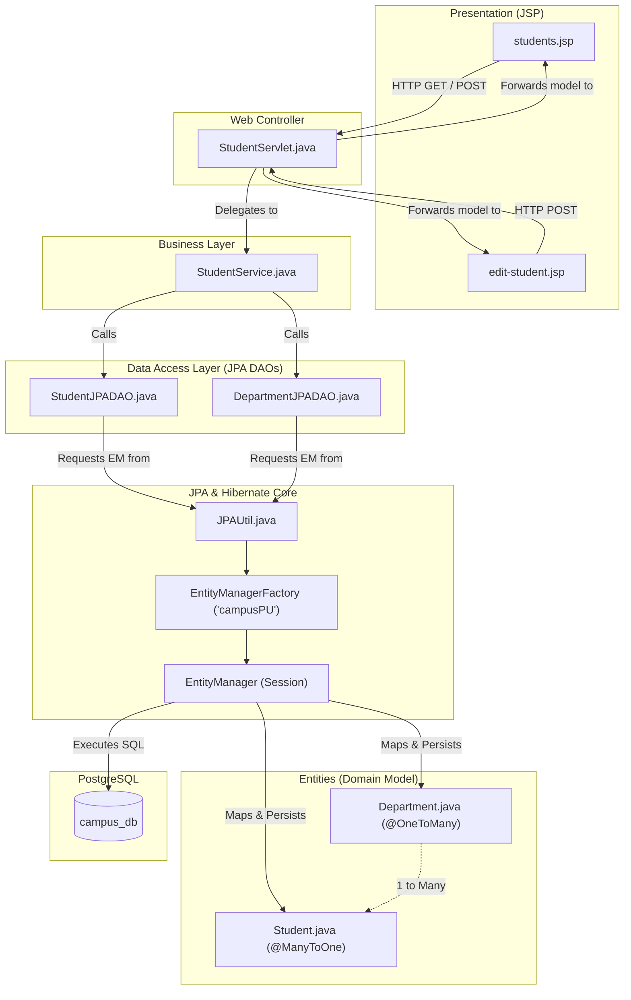

---

### 🌐 1. `StudentServlet.java` Method Flowcharts

#### `doGet(HttpServletRequest request, HttpServletResponse response)`
Handles page requests, data loading, filtering, and deletion:

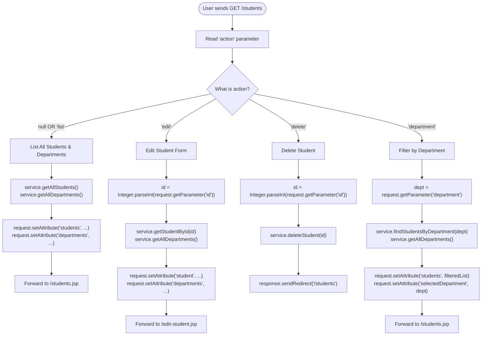

---

#### `doPost(HttpServletRequest request, HttpServletResponse response)`
Handles form submissions (Adding new students or Updating existing ones):

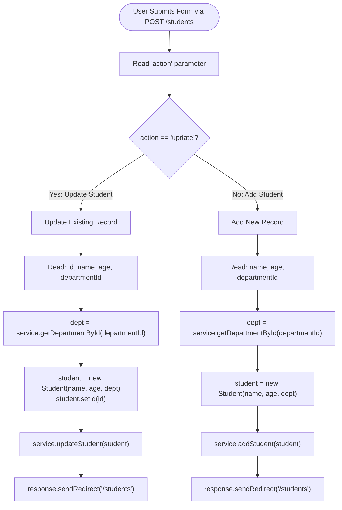

---

### 💼 2. `StudentService.java` Method Delegation

`StudentService` isolates business logic from servlets. Every method coordinates between the two DAOs:

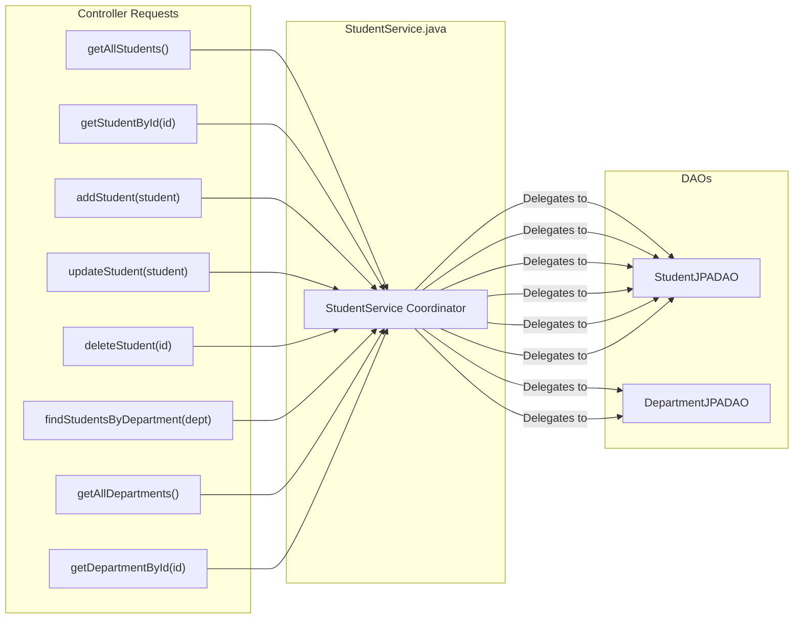

---

### 💾 3. `StudentJPADAO.java` Method Flowcharts

#### `addStudent(Student student)` — Persisting New Entity
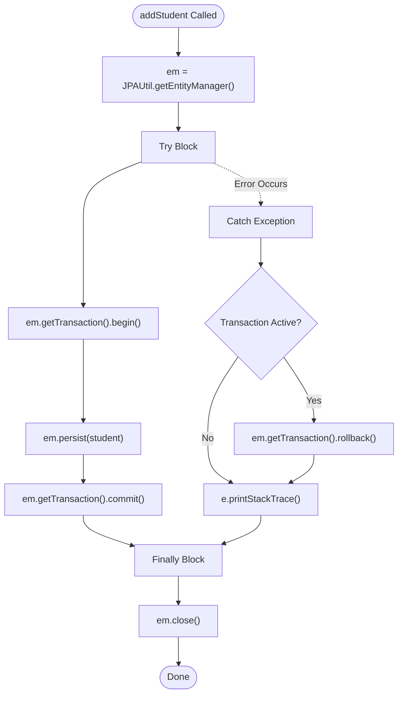

---

#### `getAllStudents()` — JPQL Query Execution
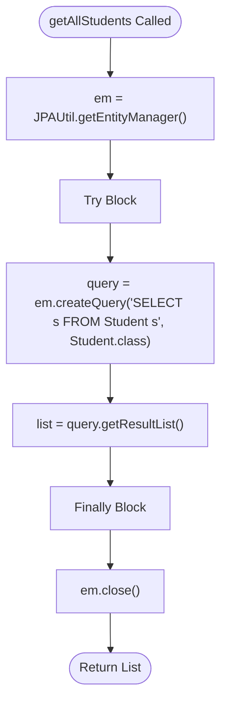

---

#### `getStudentById(int id)` — Finding by Primary Key
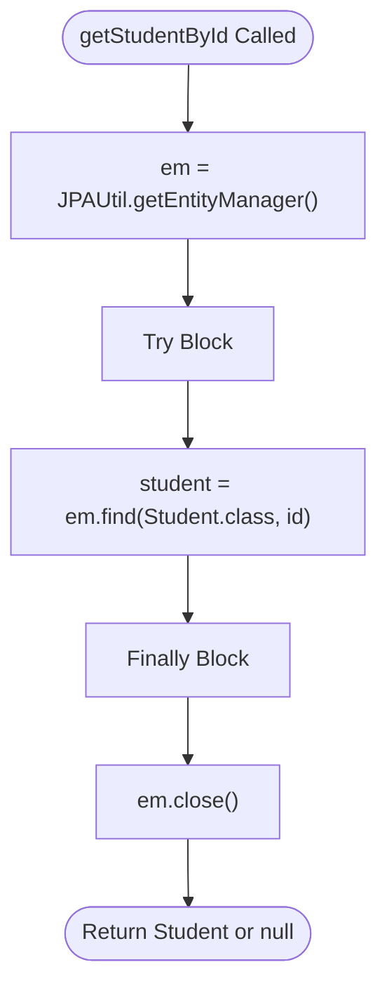

---

#### `updateStudent(Student student)` — Merging Changes
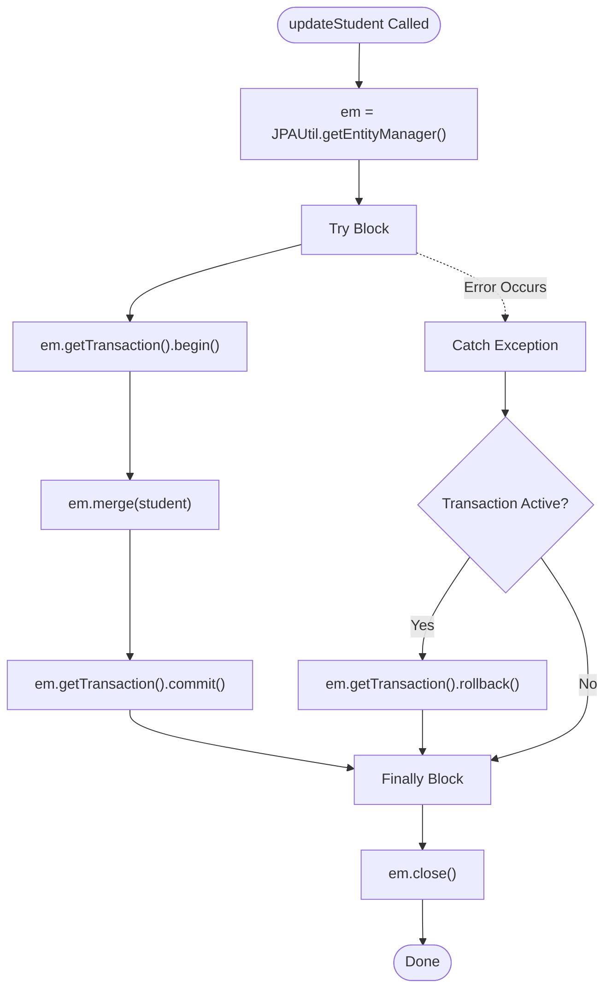

---

#### `deleteStudent(int id)` — Finding & Removing
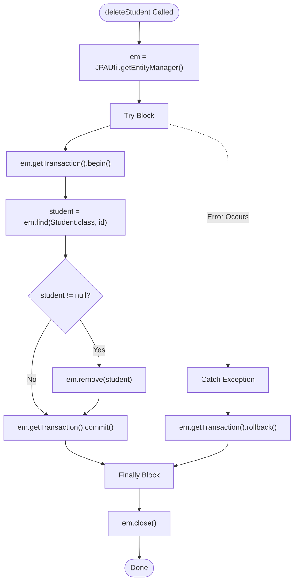

---

#### `findStudentsByDepartment(String departmentName)` — Parameterized JPQL
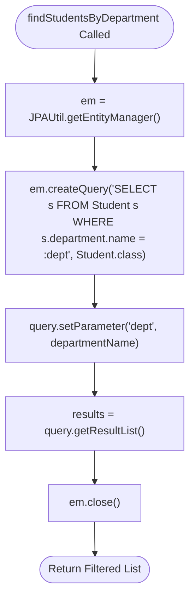

---

### 🏢 4. `DepartmentJPADAO.java` Method Flowcharts

#### `getAllDepartments()` & `getDepartmentById(int id)`
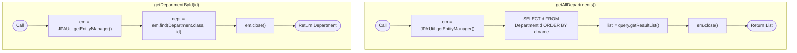

---

### 🏭 5. `JPAUtil.java` Lifecycle Flowchart

How the application initializes the factory once and vends connections safely:

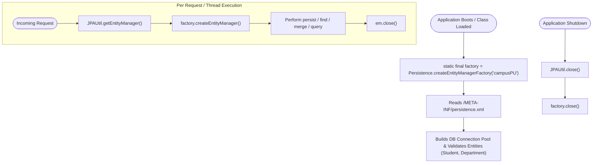

---

### 🔗 6. Entity Relationship Diagram (Object Graph)

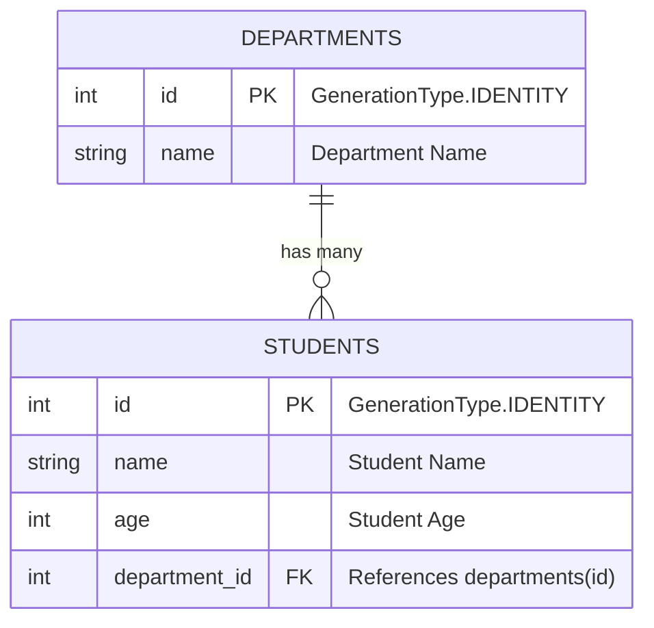

