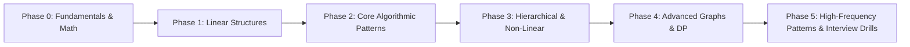
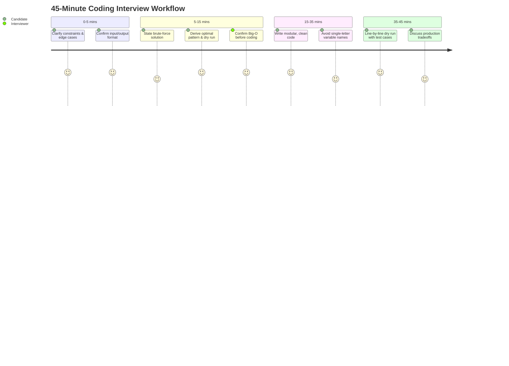

# 🧠 Data Structures & Algorithms (DSA) Roadmap (2026 - 2027)

> **"DSA is not about memorizing 500 problems; it is about mastering the 16 core algorithmic patterns that solve 95% of technical interview questions."**

---

## 📌 Roadmap Overview



---

## 💡 Why DSA Matters in the Real World (Beyond Interviews)

Many junior developers mistake Data Structures and Algorithms for an "academic test" or "interview gatekeeping." In production engineering, DSA directly impacts system performance, user latency, and cloud infrastructure cost:

1. **Massive Cloud Cost Reduction**: In modern cloud systems (AWS, GCP, Azure), you pay for CPU time and RAM usage. An un-indexed $O(N^2)$ lookup running over 10 million transactions can cost thousands of dollars per month in compute time, whereas an $O(N)$ or $O(1)$ Hash Map/B-Tree approach executes in milliseconds for pennies.
2. **SLA & Latency Guarantees**: A user expects API responses under 100ms. If your algorithm has suboptimal complexity, a minor traffic spike causes thread pool exhaustion, cascade failures, and site outages.
3. **Memory Footprint & Crash Prevention**: Choosing the wrong data structure leads to memory leaks, garbage collection thrashing (stop-the-world pauses in Java/JVM), or out-of-memory (`OOM`) kills in Docker/Kubernetes pods.
4. **Role-Specific Real-World Impact**:
   - **Java Backend**: Designing high-throughput thread-safe caches, avoiding lock contention, and tuning concurrent collections.
   - **Python Full-Stack + AI**: Vector search retrieval, streaming tokens, efficient memory buffers for async request queues.
   - **Data Analytics & Science**: Vectorized array operations, grouping and pivoting millions of rows, graph network analysis.
   - **ML & Gen AI**: KV-cache memory management in Transformers, matrix multiplications, priority queue beam search, and embedding nearest-neighbor lookup (HNSW graphs).

---

## 🌍 All Major Data Structures with Real-World Production Examples

Every data structure was engineered to solve a specific physical and memory constraint. Below is the complete encyclopedia of data structures with their real-world software applications:

| # | Data Structure | Time Complexity (Avg / Worst) | Real-World Production Example | How It Is Used in Real Software |
|---|----------------|-------------------------------|-------------------------------|----------------------------------|
| 1 | **Arrays / Dynamic Arrays** | Access: $O(1)$<br>Search: $O(N)$<br>Insert: $O(N)$ | In-Memory Columnar Engines (ClickHouse, Apache Arrow, NumPy) | Stores homogeneous data in contiguous memory for L1/L2 CPU cache prefetching and SIMD vectorization. |
| 2 | **Linked Lists** (Singly / Doubly) | Access: $O(N)$<br>Insert/Delete at Head/Tail: $O(1)$ | LRU Cache (Redis, Memcached), Music Playlists, OS Memory Free Lists | Doubly Linked List nodes are spliced and moved to head in $O(1)$ time when combined with a Hash Map (LRU Cache). |
| 3 | **Stacks (LIFO)** | Push/Pop: $O(1)$<br>Peek: $O(1)$ | Browser History (Back/Forward), Undo/Redo (`Ctrl+Z`), Compiler Parsing | JVM/Python execution call stacks; syntax validation in code editors (matching braces, JSX, HTML tags). |
| 4 | **Queues (FIFO) & Deques** | Enqueue/Dequeue: $O(1)$ | Message Brokers (Kafka, RabbitMQ), OS Printer Spooling, Web Server Requests | Buffers incoming HTTP requests (Netty/Tomcat) to process jobs in arrival order without dropping traffic. |
| 5 | **Hash Tables / Hash Maps** | Search/Insert/Delete: $O(1)$ avg, $O(N)$ worst | In-Memory DBs (Redis), Database Hash Indexes, Symbol Tables in Compilers | Instant $O(1)$ key lookups using cryptographic or Murmur hash functions with collision handling (Chaining/Open Addressing). |
| 6 | **Binary Search Trees (BST) & Self-Balancing Trees (AVL, Red-Black)** | Search/Insert/Delete: $O(\log N)$ | Database In-Memory Indexes, Java `TreeMap`/`TreeSet`, Linux CFS Scheduler | Maintains ordered elements dynamically. Linux kernel's Completely Fair Scheduler (CFS) uses Red-Black trees to schedule processes by CPU runtime. |
| 7 | **B-Trees & B+ Trees** | Search/Insert/Delete: $O(\log_B N)$ | Relational Database Storage Engines (Postgres, MySQL InnoDB), Filesystems (NTFS, ext4) | High branching factor minimizes expensive disk I/O operations by storing hundreds of keys per disk block node. |
| 8 | **Heaps / Priority Queues** | Insert: $O(\log N)$<br>Extract-Min/Max: $O(\log N)$<br>Peek: $O(1)$ | OS CPU Task Scheduling, Emergency Triage, Dijkstra's Shortest Path, Top-K Trending | Always returns the highest/lowest priority element instantly. Powering Google Maps navigation and real-time Twitter/X trending hashtags. |
| 9 | **Graphs** (Directed, Undirected, DAG, Weighted) | BFS/DFS: $O(V + E)$ | Social Networks (LinkedIn, Facebook), Uber Ride Matching, Google Maps, Build Systems | Models complex entity connections. Directed Acyclic Graphs (DAGs) power build tools (Maven, Gradle, Airflow, Dagster). |
| 10 | **Tries (Prefix Trees)** | Insert/Search: $O(L)$ where $L$ is word length | Search Autocomplete (Google Search, VS Code IntelliSense), IP Routing Tables | Finds all words matching a prefix in time proportional to the prefix length, independent of total database size. |
| 11 | **Disjoint Set Union (DSU / Union-Find)** | Find/Union: $\approx O(1)$ (Inverse Ackermann $\alpha(N)$) | Network Connectivity, Kruskal's MST (Fiber Optic Cables), Image Segmentation | Dynamically checks if two nodes belong to the same connected component and avoids cycles in electrical and optical grids. |
| 12 | **Segment Trees & Fenwick Trees (BIT)** | Point Update: $O(\log N)$<br>Range Query: $O(\log N)$ | High-Frequency Stock Trading, Live Leaderboard Engines, GIS Range Querying | Answers dynamic range sum/min/max queries over continuously changing arrays (e.g., stock price fluctuations over sliding time intervals). |
| 13 | **Bloom Filters** (Probabilistic) | Add: $O(K)$<br>Query: $O(K)$ ($0\%$ False Negatives) | Apache Cassandra, Google Chrome Malicious URL Checker, CDN Cache Avoidance | Tests if an element *might* be in a set or *definitely isn't*, preventing expensive disk reads for non-existent records using tiny memory. |
| 14 | **Spatial Trees (QuadTree, K-D Tree, R-Tree)** | Spatial Search: $O(\log N)$ | Ride-Hailing Driver Matching (Uber/Lyft), Yelp "Near Me", Video Game 3D Physics | Divides 2D/3D space hierarchically to find all entities within a 2-mile radius without checking every driver on Earth. |

---

## ⏱️ Phase 0: Foundations & Complexity Analysis (Week 1–2)

### 1. Asymptotic Notation (Big O)
- **Time Complexity**: $O(1)$, $O(\log N)$, $O(N)$, $O(N \log N)$, $O(N^2)$, $O(2^N)$, $O(N!)$
- **Space Complexity**: Auxiliary space vs Input space, Call stack overhead in recursion.
- **Rules of Thumb for LeetCode Contests & Screenings**:
  | Input Constraint ($N$) | Allowed Time Complexity | Expected Approach |
  |------------------------|-------------------------|-------------------|
  | $N \le 10$ | $O(N!)$ or $O(2^N \cdot N)$ | Recursion / Backtracking / Bitmask |
  | $N \le 20$ | $O(2^N)$ | Backtracking / DP with Bitmask |
  | $N \le 100$ | $O(N^4)$ or $O(N^3)$ | Floyd-Warshall / Multi-loop DP |
  | $N \le 1,000$ | $O(N^2)$ | Dynamic Programming, Nested loops |
  | $N \le 10^5$ | $O(N \log N)$ or $O(N)$ | Sorting, Binary Search, Heap, Two Pointers |
  | $N \le 10^9$ | $O(\log N)$ or $O(1)$ | Binary Search, Math, Bit Manipulation |

### 2. Language Choice & Standard Template Libraries (STL)
- **Java**: `ArrayList`, `LinkedList`, `ArrayDeque`, `PriorityQueue`, `HashMap`, `TreeMap`, `HashSet`, `TreeSet`.
- **Python**: `list`, `deque` (`collections`), `heapq`, `dict`, `set`, `Counter`, `bisect`.
- **Key Competency**: Implementing custom Comparators (`Comparable` / `Comparator` in Java, `key=lambda` in Python).

---

## 🧱 Phase 1: Linear Data Structures (Week 3–5)

### 1. Arrays & Strings
- **Key Mechanics**: Contiguous memory, cache locality, prefix sums, 2D matrices.
- **Must-Do Problems**:
  - Two Sum (LC 1)
  - Best Time to Buy and Sell Stock (LC 121)
  - Product of Array Except Self (LC 238)
  - Maximum Subarray / Kadane's Algorithm (LC 53)
  - Spiral Matrix (LC 54)

### 2. Linked Lists
- **Key Mechanics**: Node pointer manipulation, dummy head technique, fast & slow pointers.
- **Must-Do Problems**:
  - Reverse a Linked List (LC 206)
  - Merge Two Sorted Lists (LC 21)
  - Reorder List (LC 143)
  - Linked List Cycle & Intersection (LC 141, LC 160)
  - LRU Cache (LC 146) — *Fundamental interview question*

### 3. Stacks & Queues
- **Key Mechanics**: LIFO vs FIFO, Monotonic Stack pattern, Circular Queues.
- **Must-Do Problems**:
  - Valid Parentheses (LC 20)
  - Min Stack (LC 155)
  - Daily Temperatures (LC 739) — *Monotonic Stack*
  - Largest Rectangle in Histogram (LC 84) — *Monotonic Stack*
  - Implement Queue using Stacks (LC 232)

---

## 🎯 Phase 2: The Core 16 Algorithmic Patterns (Week 6–10)

Mastering these 16 patterns is the single highest-ROI activity for cracking coding interviews:

| # | Pattern Name | When to Apply | Canonical LeetCode |
|---|--------------|---------------|-------------------|
| 1 | **Two Pointers** | Sorted arrays, pair sums, palindrome checking | LC 15 (3Sum), LC 11 (Container With Most Water) |
| 2 | **Sliding Window** | Substrings/subarrays meeting min/max/exact condition | LC 3 (Longest Substring Without Repeating), LC 76 |
| 3 | **Fast & Slow Pointers** | Cycle detection, middle element of linked list/array | LC 142 (Linked List Cycle II), LC 202 (Happy Number) |
| 4 | **Prefix Sum / Hashing** | Subarray sum equals $K$, range query optimizations | LC 560 (Subarray Sum Equals K), LC 525 |
| 5 | **Monotonic Stack** | Next greater/smaller element, stock spans, histograms | LC 739 (Daily Temperatures), LC 84, LC 901 |
| 6 | **Binary Search on Answer** | Min-max or max-min optimization over monotonic answer space | LC 875 (Koko Eating Bananas), LC 1011 (Ship Packages) |
| 7 | **Merge Intervals** | Overlapping ranges, scheduling, calendar intervals | LC 56 (Merge Intervals), LC 57 (Insert Interval), LC 435 |
| 8 | **Top K Elements (Heap)** | Finding smallest/largest $K$ elements dynamically | LC 215 (Kth Largest Element), LC 347 (Top K Frequent) |
| 9 | **Two Heaps Pattern** | Tracking running median in a streaming dataset | LC 295 (Find Median from Data Stream) |
| 10 | **Level Order Traversal (BFS)**| Shortest path in unweighted graphs/trees, level scans | LC 102 (Binary Tree Level Order), LC 994 (Rotting Oranges) |
| 11 | **Depth-First Search (DFS)** | Path finding, connected components, tree properties | LC 200 (Number of Islands), LC 124 (Max Path Sum) |
| 12 | **Topological Sort** | Dependency resolution, prerequisite course ordering | LC 207 (Course Schedule I & II), LC 269 (Alien Dictionary) |
| 13 | **Disjoint Set Union (DSU)** | Dynamic connectivity, cycle detection in undirected graphs | LC 684 (Redundant Connection), LC 1319 |
| 14 | **Backtracking** | Exhaustive permutation, combination, partition generation | LC 78 (Subsets), LC 46 (Permutations), LC 51 (N-Queens) |
| 15 | **0/1 Knapsack & DP State**| Optimal decisions with finite resources/choices | LC 416 (Partition Equal Subset Sum), LC 322 (Coin Change) |
| 16 | **Trie (Prefix Tree)** | Prefix lookups, autocomplete, wildcard word dictionaries | LC 208 (Implement Trie), LC 212 (Word Search II) |

---

## 🌲 Phase 3: Trees, Heaps & Graphs (Week 11–14)

### 1. Binary Trees & Binary Search Trees (BST)
- **Concepts**: Pre-order, In-order, Post-order (Recursive & Iterative), Height, Balanced Trees, BST invariants.
- **Must-Do Problems**:
  - Maximum Depth of Binary Tree (LC 104)
  - Invert/Flip Binary Tree (LC 226)
  - Diameter of Binary Tree (LC 543)
  - Lowest Common Ancestor of a Binary Tree (LC 236)
  - Validate Binary Search Tree (LC 98)
  - Serialize and Deserialize Binary Tree (LC 297)

### 2. Heaps & Priority Queues
- **Concepts**: Min-Heap vs Max-Heap, Heapify in $O(N)$, insertion/deletion in $O(\log N)$.
- **Must-Do Problems**:
  - Merge K Sorted Lists (LC 23)
  - Task Scheduler (LC 621)
  - Find Median from Data Stream (LC 295)

### 3. Graphs (Breadth-First, Depth-First, Shortest Paths)
- **Graph Representations**: Adjacency Matrix vs Adjacency List (Vector of Lists).
- **Core Algorithms**:
  - **BFS / Multi-source BFS**: Shortest path in unweighted graph (`LC 994`, `LC 1091`).
  - **Dijkstra's Algorithm**: Single-source shortest path with positive weights (`LC 743`).
  - **Bellman-Ford & Floyd-Warshall**: Negative weights, all-pairs shortest paths.
  - **Bipartite Graph Check**: 2-coloring via BFS/DFS (`LC 785`).
  - **Minimum Spanning Tree (MST)**: Kruskal's (DSU) and Prim's algorithm.

---

## 🧩 Phase 4: Dynamic Programming & Advanced Algorithms (Week 15–18)

Dynamic Programming is conquered by **State Identification** and **Transition Equations**:

```
Recursion (Brute Force) ➡️ Memoization (Top-Down) ➡️ Tabulation (Bottom-Up) ➡️ Space Optimized ($O(1)$ or $O(N)$)
```

### 1. 1D Dynamic Programming
- Climbing Stairs (LC 70)
- House Robber I & II (LC 198, LC 213)
- Longest Increasing Subsequence (LC 300) — *O(N log N) with Binary Search*
- Coin Change (LC 322)
- Word Break (LC 139)

### 2. 2D / Grid Dynamic Programming
- Unique Paths I & II (LC 62, LC 63)
- Minimum Path Sum (LC 64)
- Longest Common Subsequence (LC 1143)
- Edit Distance (LC 72)
- Target Sum (LC 494)

### 3. String & Interval DP
- Longest Palindromic Substring (LC 5)
- Palindromic Substrings (LC 647)
- Burst Balloons (LC 312)

---

## 📋 Phase 5: Interview Execution Strategy (Week 19–20)

### The 45-Minute Interview Blueprint



### Critical Edge Cases Checklist Before You Say "I'm Done":
- [ ] Empty input / null / length 0 or 1.
- [ ] Negative numbers, all zeroes, or duplicates.
- [ ] Integer overflow ($> 2^{31}-1$). Use 64-bit integer (`long` in Java).
- [ ] Odd vs Even length inputs.
- [ ] Disconnected graph components or cycles.
