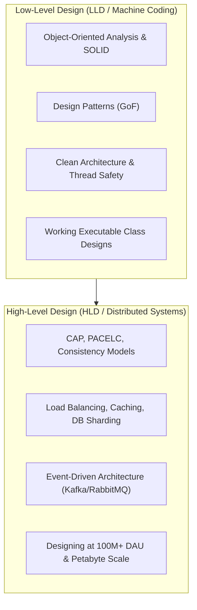
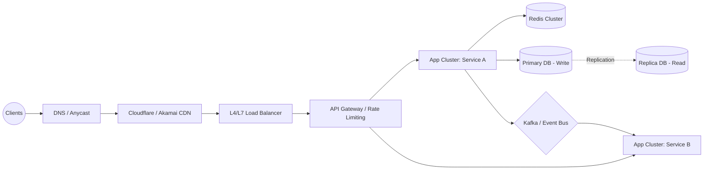

# 🏛️ System Design Roadmap: LLD & HLD (2026 - 2027)

> **"A senior engineer doesn't build complex systems; they build simple systems that survive massive scale and unpredictable failures."**

---

## 🗺️ Architectural Spectrum



---

## 📐 Part 1: Low-Level Design (LLD) & Object-Oriented Design

Low-Level Design tests your ability to translate ambiguous business requirements into **extensible, clean, testable, and thread-safe code**.

### 1. SOLID Principles Applied
- **S (Single Responsibility)**: A class should have one, and only one, reason to change.
- **O (Open/Closed)**: Open for extension, closed for modification (use interfaces/abstract classes).
- **L (Liskov Substitution)**: Derived classes must be substitutable for their base types without breaking invariants.
- **I (Interface Segregation)**: Avoid fat interfaces; split into cohesive client-specific contracts.
- **D (Dependency Inversion)**: High-level modules should depend on abstractions, not concretions.

### 2. Gang of Four (GoF) Design Patterns (The Essential 10)
| Category | Pattern | Real-World Use Case |
|----------|---------|---------------------|
| **Creational** | **Singleton** | Database connection pools, Config manager (Thread-safe Double-Checked Locking) |
| | **Factory / Abstract Factory** | Payment gateway selector (Stripe, PayPal, Razorpay) |
| | **Builder** | Constructing complex immutable domain objects (e.g., HTTP Request, User Profile) |
| **Structural** | **Adapter** | Wrapping legacy third-party APIs to match current internal interfaces |
| | **Decorator** | Adding dynamic features (e.g., Pizza toppings, Espresso condiments, Encryption/Compression streams) |
| | **Facade** | Simplifying complex multi-subsystem workflows (e.g., Order Checkout Facade) |
| **Behavioral** | **Strategy** | Pluggable algorithms (e.g., Pricing discounts, Route calculation, Sort algorithms) |
| | **Observer / Pub-Sub** | Event notification systems, UI reactive state, Kafka consumer dispatchers |
| | **State** | Lifecycle workflows (e.g., Vending machine states, Order status: `Placed -> Shipped -> Delivered`) |
| | **Chain of Responsibility** | Request middleware, Authentication & Authorization filter pipelines |

### 3. High-Frequency LLD Machine Coding Problems
In machine coding rounds (90–120 minutes), you must produce working, runnable code with unit tests:
1. **Design a Parking Lot** (Multi-floor, vehicle sizes, dynamic slot allocation, billing strategy).
2. **Design an In-Memory Key-Value Store** with TTL, transaction support (`BEGIN`, `COMMIT`, `ROLLBACK`), and LRU eviction.
3. **Design a Distributed Rate Limiter** (Token Bucket, Leaky Bucket, Sliding Window Counter).
4. **Design an Elevator Management System** (Dispatch algorithms, multi-car coordination).
5. **Design a Ride-Sharing Matching Engine** (Cab booking, driver discovery, surge pricing strategy).
6. **Design Splitwise** (Expense splitting, exact/percentage/equal, debt simplification graph algorithm).

---

## 🌐 Part 2: High-Level Design (HLD) & Distributed Systems

### 1. Core Principles & Foundational Theorems
- **CAP Theorem**: Consistency, Availability, Partition Tolerance (In network partitions, choose CP or AP).
- **PACELC Theorem**: If Partition (P): Availability (A) vs Consistency (C); Else (E): Latency (L) vs Consistency (C).
- **Data Consistency Models**:
  - Strong Consistency (Linearizable)
  - Eventual Consistency
  - Read-your-own-writes (Causal consistency)
- **Idempotency**: Using idempotency keys (`UUID` header) to prevent duplicate transactions.

### 2. Scalability Building Blocks



- **Load Balancing**:
  - Layer 4 (TCP/UDP) vs Layer 7 (HTTP/gRPC, path-based routing).
  - Algorithms: Round Robin, Weighted Least Connections, **Consistent Hashing** (vital for distributed caching & ring topologies).
- **Caching Strategies**:
  - Policies: Cache-Aside (Lazy loading), Write-Through, Write-Behind, Refresh-Ahead.
  - Eviction: LRU, LFU, FIFO, TTL expiry.
  - Cache Gotchas: Cache Avalanche, Cache Stampede (Thundering Herd), Cache Penetration (Bloom filters).
- **Database Scaling**:
  - **SQL (Postgres, MySQL)**: ACID, B-Tree indexes, Connection pooling (PgBouncer), Master-Replica replication, Read replicas.
  - **NoSQL**:
    - Key-Value: Redis, DynamoDB (Consistent Hashing, Dynamo paper).
    - Document: MongoDB.
    - Columnar: Cassandra, ScyllaDB (LSM Trees, SSTables, high write throughput).
    - Vector Databases (2026 standard): Pinecone, Milvus, Qdrant, pgvector (HNSW indexing for LLMs).
  - **Partitioning & Sharding**: Range-based, Hash-based, Directory-based. Handling re-sharding and cross-shard queries.
- **Asynchronous Processing & Event Streaming**:
  - Message Queues (RabbitMQ, SQS) vs Log-Centric Event Streams (Apache Kafka).
  - Consumer Groups, Partitions, Offset commits, Exactly-Once Semantics (EOS).

---

## 🏗️ Part 3: Classic & Modern System Design Case Studies

### 1. URL Shortener (TinyURL / Bitly)
- **Core Challenge**: High read-to-write ratio (100:1), low latency, collision handling.
- **Techniques**: Base62 encoding, pre-generated unique key token service (KGS), Redis LRU cache, MD5/SHA-256 with counter offset.

### 2. Real-Time Chat & Messaging (WhatsApp / Discord)
- **Core Challenge**: Bi-directional real-time communication, presence indicator, offline message delivery.
- **Techniques**: WebSockets, Gateway connection manager, Cassandra/HBase for unread/historical chat storage, Redis Pub/Sub for ephemeral message routing.

### 3. Video Streaming Service (YouTube / Netflix)
- **Core Challenge**: Terabits per second throughput, dynamic bitrate adaptation, multi-device transcoding.
- **Techniques**: Chunking & Transcoding workers, HLS / DASH protocols, Geo-distributed CDNs, Cloud Object Storage (S3), Metadata microservices.

### 4. Distributed Proximity Service (Uber / Yelp / Google Maps)
- **Core Challenge**: Fast spatial lookup of nearby drivers/venues with real-time GPS updates.
- **Techniques**: Spatial Indexing: **Geohash**, **Google S2 Geometry**, or **Uber H3** (Hexagonal hierarchical spatial index), In-memory location cache (Redis Geo).

### 5. Modern 2026 Addition: Large-Scale LLM / RAG Serving Platform
- **Core Challenge**: Streaming tokens with high TTFT (Time to First Token), GPU resource management, vector embeddings at scale.
- **Techniques**: vLLM / TensorRT-LLM cluster, continuous batching, pgvector/Qdrant vector cache, semantic caching with Redis, asynchronous tool-calling pipelines.

---

## ⏱️ The 45-Minute HLD Interview Framework

```
[00:00 - 05:00] Step 1: Scope & Clarify Requirements (Functional & Non-Functional)
[05:00 - 10:00] Step 2: Back-of-the-Envelope Capacity Estimations (RPS, Storage, Bandwidth)
[10:00 - 15:00] Step 3: High-Level Architecture (Draw Client -> LB -> App -> DB)
[15:00 - 25:00] Step 4: Deep Dive into Core Components & Data Models
[25:00 - 40:00] Step 5: Bottlenecks, Edge Cases, Fault Tolerance & Scalability
[40:00 - 45:00] Step 6: Summary & Tradeoff Review
```
