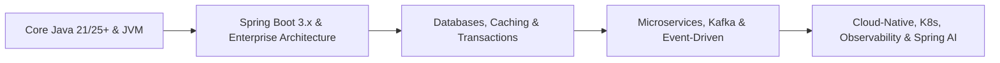

# ☕ Modern Java Backend Developer Roadmap (2026 - 2027)

> **"Java in 2026+ is lightweight, blazingly fast, and concurrent-by-default thanks to Virtual Threads (Project Loom), modern JVMs, and Spring Boot 3.x / Spring AI."**

---

## 🎯 Career Progression Stages



---

## 💼 Roles & Responsibilities in Production

### 1. Core Mission
A Modern Java Developer architects, builds, and maintains mission-critical backend systems that process financial transactions, high-volume telemetry, and enterprise business workflows with sub-100ms latency and 99.99% uptime.

### 2. Day-to-Day Responsibilities
- **API & Service Development**: Building secure, RESTful, and gRPC microservices using Java 21+ and Spring Boot 3.x.
- **Data Architecture & Optimization**: Designing relational tables (PostgreSQL/MySQL), optimizing complex JPA/Hibernate queries, resolving N+1 bottlenecks, and handling Flyway schema migrations.
- **Asynchronous Event Processing**: Writing reliable Kafka producers and consumers, ensuring idempotent message processing, and managing Dead Letter Queues (DLQ).
- **Concurrency & JVM Performance Tuning**: Configuring Virtual Threads (Project Loom), diagnosing thread contention, analyzing heap dumps with JProfiler, and tuning G1/ZGC garbage collectors.
- **Testing & Resilience**: Writing unit tests with JUnit 5/Mockito and end-to-end integration tests using Testcontainers (real spinning Docker containers for DB and Kafka).

### 3. Seniority Expectations
| Level | Scope & Daily Expectations | Key Deliverable |
|-------|----------------------------|-----------------|
| **Junior Java Dev** | Implements CRUD endpoints, writes unit tests, fixes bugs, and follows established team patterns. | Well-tested REST endpoints, PRs with 80%+ test coverage. |
| **Mid-Level Java Dev** | Owns complete microservices, designs database schemas, integrates Kafka streams, and troubleshoots production bugs. | End-to-end feature microservices, optimized SQL queries, CI/CD pipeline integration. |
| **Senior / Lead Dev** | Defines distributed architecture, enforces clean code & SOLID standards, resolves high-concurrency race conditions, and mentors engineers. | High-throughput system architecture, distributed lock/transaction design, low-latency JVM optimizations. |

---

## 🚀 Stage 1: Modern Java Core (Java 17, 21 LTS & 25)

### 1. Modern Syntax & Language Features
- **Records**: Immutable data carriers (`record UserDto(String id, String email) {}`).
- **Pattern Matching**: Pattern matching for `instanceof`, pattern matching for `switch` expressions, record deconstruction patterns.
- **Sealed Classes & Interfaces**: Strict domain hierarchy modeling (`sealed interface Shape permits Circle, Square`).
- **Sequenced Collections**: Uniform access to first/last elements across `List`, `Deque`, `LinkedHashMap`.
- **String Templates & Text Blocks**: Multi-line SQL/JSON formatting with multi-line text blocks.

### 2. Concurrency & Project Loom (Revolution in Java)
- **Virtual Threads (`Thread.ofVirtual().start()`)**: M:N user-mode threading replacing heavy OS platform threads. Handles 100k+ concurrent requests per server without reactive overhead.
- **Structured Concurrency**: Treating multiple tasks running in different threads as a single unit of work (`StructuredTaskScope`).
- **Scoped Values**: Lightweight, immutable thread-local alternatives for high-throughput thread pools.
- **Classic Concurrency**: `ExecutorService`, `CompletableFuture`, `ReentrantLock`, `AtomicInteger`, `ConcurrentHashMap`.

### 3. Deep JVM Internals & Memory Architecture
- **JVM Memory Areas**: Heap (Young Gen / Eden, Survivor spaces, Old Gen), Non-Heap (Metaspace, CodeCache, Thread Stacks).
- **Garbage Collection (GC)**:
  - **G1GC**: Balanced throughput and latency default.
  - **Generational ZGC**: Ultra-low latency GC with sub-millisecond pauses on terabyte heaps.
- **JVM Profiling**: `jcmd`, `jstack`, `jmap`, **async-profiler**, JDK Flight Recorder (JFR) & Mission Control.

---

## 🍃 Stage 2: Spring Boot 3.x & Enterprise Architecture

### 1. Spring Framework Core
- **Dependency Injection (IoC)**: Bean scopes (`@Singleton`, `@Prototype`, `@RequestScope`), `@Configuration`, `@Bean`, Lifecycle callbacks (`@PostConstruct`).
- **Spring Boot 3.x Architecture**:
  - Requires Java 17+ (Runs natively on Java 21+).
  - Jakarta EE 10 namespace (`jakarta.*` replacing `javax.*`).
  - Spring Boot Actuator for health, metrics, and Prometheus endpoints.
  - Native Image Compilation via **GraalVM** for instant boot time and minimal RAM.

### 2. Spring Web & REST APIs
- Clean RESTful API design, `@RestController`, `@ExceptionHandler` and `@ControllerAdvice` for standardized Problem Details (`RFC 7807`).
- DTO Validation (`jakarta.validation.constraints.*`).
- Asynchronous API handling with `CompletableFuture` and Virtual Threads configuration:
  ```properties
  spring.threads.virtual.enabled=true
  ```

### 3. Spring Security 6 & Authentication
- Stateless Authentication: **JWT (JSON Web Tokens)** + Spring Security Filters.
- **OAuth 2.0 & OIDC**: Integration with Keycloak, Auth0, or AWS Cognito.
- Role-Based Access Control (RBAC) & Method Security (`@PreAuthorize("hasRole('ADMIN')")`).

---

## 💾 Stage 3: Data Persistence & Distributed Caching

### 1. Relational Databases & ORM
- **Spring Data JPA & Hibernate 6**:
  - Entity relationships (`@OneToMany`, `@ManyToOne`, `@ManyToMany`).
  - The infamous **N+1 Problem** and how to fix it (`JOIN FETCH`, `@EntityGraph`).
  - Projection queries (DTO and Interface projections).
  - Dirty Checking, 1st & 2nd Level Caching.
- **Database Migrations**: **Flyway** or **Liquibase** for version-controlled DB schema changes.
- **Connection Pooling**: HikariCP tuning (Max pool size, connection timeout, idle timeout).

### 2. Distributed Caching & Locks
- **Redis Integration**: `RedisTemplate`, Spring Cache abstractions (`@Cacheable`, `@CacheEvict`, `@CachePut`).
- Distributed locks with **Redisson** for multi-instance transaction coordination.

---

## ⚡ Stage 4: Microservices, Messaging & Spring AI

### 1. Event-Driven Systems with Apache Kafka
- **Kafka Core**: Topics, Partitions, Consumer Groups, Offsets, Brokers.
- **Spring for Apache Kafka**:
  - `@KafkaListener`, `KafkaTemplate`.
  - Handling poison pills, Dead Letter Topics (DLT), and idempotency.
  - Exactly-Once Processing (EOP) and Outbox Pattern with Debezium (CDC - Change Data Capture).

### 2. Microservice Patterns
- **API Gateway**: Spring Cloud Gateway (Routing, rate limiting, token relay).
- **Service Resilience**: **Resilience4j** (Circuit Breakers, Rate Limiters, Retry, Bulkhead).
- **Inter-Service Communication**: OpenFeign, HTTP Client (`RestClient` / `WebClient`), gRPC for low-latency RPC.

### 3. Spring AI (2026 Enterprise Trend)
- Modern enterprise backend developers must build AI-powered endpoints:
  - Spring AI client abstractions for OpenAI, Ollama, Anthropic.
  - Vector Store integration (PgVector, Redis, Milvus) directly in Spring Boot services.
  - Retrieval-Augmented Generation (RAG) within standard enterprise Spring microservices.

---

## 🛠️ Stage 5: Cloud-Native, Testing & Observability

### 1. Robust Testing (The Enterprise Standard)
- **Unit Testing**: JUnit 5, AssertJ, Mockito.
- **Integration Testing with Testcontainers**: Spinning up real Postgres, Redis, and Kafka Docker containers during Maven/Gradle test phases!
- **Contract & API Testing**: WireMock, RestAssured.

### 2. Observability & DevOps
- **OpenTelemetry (OTel)**: Distributed tracing across microservices.
- **Metrics & Dashboards**: Micrometer -> Prometheus -> Grafana.
- **Centralized Logging**: Logstash / Fluentbit -> Elasticsearch / Loki -> Kibana / Grafana.
- **Containerization & CI/CD**: Docker multi-stage builds, Kubernetes manifests / Helm charts, GitHub Actions workflows.

---

## 🏆 Production Capstone Projects for Your Resume

1. **High-Throughput Fintech Payment Gateway**:
   - Spring Boot 3 + Virtual Threads + Kafka + Redis distributed lock + PostgreSQL (Outbox pattern).
   - Handles simulated 10,000 TPS with idempotent webhook retries and Testcontainers suite.
2. **Enterprise AI-Assisted Document & Search Microservice**:
   - Spring AI + PgVector + Redis cache + Spring Security 6 OAuth2.
   - Ingests corporate documents, generates embeddings, performs vector search, and streams answers via Server-Sent Events (SSE).
