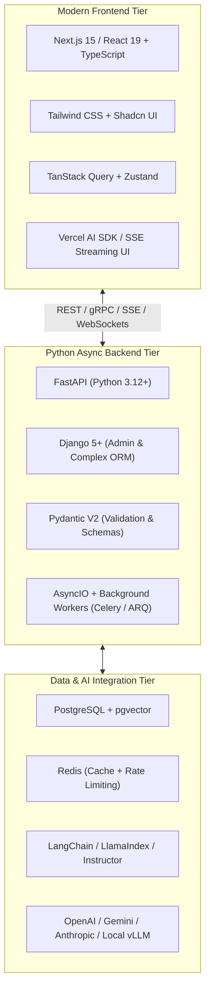

# 🐍 Python Full-Stack Developer with AI Roadmap (2026 - 2027)

> **"In the modern tech ecosystem, a Python Full-Stack Engineer is a product builder who marries high-performance async backends with slick, responsive frontends and deeply integrated AI capabilities."**

---

## 🗺️ Architectural Stack Overview

---

## 💼 Roles & Responsibilities in Production

### 1. Core Mission
A Python Full-Stack Developer with AI is an end-to-end product engineer who ships customer-facing applications that seamlessly weave generative AI (chat copilots, document intelligence, intelligent search) into modern, responsive web interfaces with sub-second response times.

### 2. Day-to-Day Responsibilities
- **Frontend Development**: Building responsive, accessible UIs using Next.js 15, React 19, TypeScript, and Tailwind CSS / Shadcn UI.
- **Backend API Engineering**: Creating async REST and WebSocket/SSE endpoints with FastAPI and Pydantic V2 to stream tokens smoothly to the frontend.
- **AI & RAG Pipeline Integration**: Integrating LLMs (OpenAI, Gemini, Anthropic), managing vector stores (pgvector, Qdrant), and writing structured extraction schemas with Instructor.
- **Asynchronous Task Architecture**: Offloading heavy AI batch workflows, document ingestion, and external scraping to Celery / ARQ workers backed by Redis.
- **Database Management**: Writing SQLAlchemy 2.0 async models, running Alembic migrations, and structuring PostgreSQL schemas.

### 3. Seniority Expectations
| Level | Scope & Daily Expectations | Key Deliverable |
|-------|----------------------------|-----------------|
| **Junior Full-Stack AI Dev** | Builds UI components, connects frontend forms to FastAPI endpoints, and implements basic OpenAI API wrappers. | Reusable React components, documented FastAPI endpoints, bug fixes. |
| **Mid-Level Full-Stack AI Dev** | Implements complete end-to-end features, builds streaming RAG pipelines, sets up Celery task queues, and manages Docker deployments. | Full-stack AI features, semantic search endpoints, optimized DB queries. |
| **Senior / Lead AI Full-Stack** | Architectures scalable multi-tenant apps, designs agentic workflows, enforces type safety across the full stack, optimizes LLM latency/cost, and mentors junior devs. | System architecture, hybrid search strategies, cost-optimized token routing, production CI/CD. |

---

## ⚡ Stage 1: Modern Python Mastery (3.12 & 3.13+)

- **Python Modern Primitives**:
  - Strict Static Typing with `typing` (`Annotated`, `TypeVar`, `Literal`, `Union` syntax `X | Y`).
  - Asynchronous Programming: `asyncio`, `async/await`, task groups, non-blocking I/O.
  - Modern Python 3.13 features: JIT compiler foundations and experimental free-threaded (no-GIL) execution.
  - Data Validation: **Pydantic V2** (Rust-backed, 10x faster serialization, BaseModel, custom validators).
  - Package Management: Modern high-speed tools like **uv** (written in Rust) or **Poetry** instead of slow pip.

---

## 🚀 Stage 2: High-Performance Python Backends

### 1. FastAPI (Primary AI Backend Framework)
- Dependency Injection system (`Depends()`).
- OpenAPI (Swagger) auto-documentation.
- **Server-Sent Events (SSE)** via `StreamingResponse` for token-by-token LLM output.
- Middleware: CORS, Authentication, Rate Limiting, Request logging.
- Background Tasks (`BackgroundTasks` for lightweight post-request processing).

### 2. Django 5+ (Batteries-Included Alternative)
- Robust built-in ORM, Migrations, and Auto-generated Admin Dashboard.
- Django REST Framework (DRF) or Django Ninja (FastAPI-like typing on Django).
- Asynchronous views and Celery integration.

### 3. Databases & Async ORM
- **PostgreSQL**: The gold standard database.
- **SQLAlchemy 2.0 (Async)** or **Tortoise-ORM** + **Alembic** database migrations.
- **Redis**: Session storage, caching layer, and pub/sub message broker.

---

## 🎨 Stage 3: Modern Frontend (Next.js & React 19)

A 2026 full-stack engineer does not use raw HTML/jQuery; you build interactive, fluid SPAs:

### 1. Core Web Fundamentals
- TypeScript: Interfaces, Generics, Utility Types, Type-safe API clients.
- Modern CSS: Tailwind CSS, CSS Grid/Flexbox, Lucide Icons, **Shadcn UI** component library.

### 2. Next.js 15 & React 19
- App Router, Server Components vs Client Components (`'use client'`).
- Server Actions & API Routes.
- **TanStack Query (React Query)**: Caching, background refetching, optimistic updates.
- State Management: **Zustand** for lightweight client state.
- Real-Time AI UI: **Vercel AI SDK** (`useChat`, `useCompletion`) connecting directly to your FastAPI backend.

---

## 🤖 Stage 4: AI & Generative AI Integration (The Core Differentiator)

### 1. LLM Orchestration & Structured Outputs
- **LLM API Providers**: OpenAI (GPT-4o), Anthropic (Claude 3.5 Sonnet), Google (Gemini 2.0/1.5 Flash).
- **Structured Data Extraction**: Using **Instructor** library with Pydantic schemas to guarantee 100% valid JSON responses from LLMs without hallucinations.
- **Prompt Engineering**: System instructions, Few-shot prompting, Chain-of-Thought (CoT).

### 2. Retrieval-Augmented Generation (RAG) Architecture
- Chunking strategies (Recursive character splitter, semantic chunking).
- Embedding models: `text-embedding-3-small`, BGE-m3, Cohere Embed.
- **Vector Databases**:
  - In-database: PostgreSQL with `pgvector` extension.
  - Dedicated: **Qdrant**, **Pinecone**, or **Milvus**.
  - Hybrid Search: Combining Dense Vector embeddings + Sparse BM25 keyword search.

### 3. AI Agents & Tool Calling
- Function Calling / Tool Calling (Enabling LLMs to query SQL databases, search the web, execute Python calculations).
- Frameworks: **LangChain**, **LangGraph** (Stateful multi-actor agent flows), **CrewAI**.

---

## 🚢 Stage 5: Async Background Tasks & Production Deployment

### 1. Asynchronous Task Queues
- **Celery** + Redis / RabbitMQ: Long-running file processing, model batch inference, report generation.
- **ARQ** (Async Redis Queue) for pure async Python workers.

### 2. Containerization & Cloud CI/CD
- Multi-stage `Dockerfile` (optimized for lightweight Python production images).
- `docker-compose.yml` orchestrating FastAPI, Next.js, Postgres, Redis, and Qdrant.
- Deployment platforms: AWS ECS / EKS, Fly.io, Render, Vercel (Frontend).
- CI/CD: Automated GitHub Actions for linting (`ruff`), testing (`pytest`), and deployment.

---

## 💼 Full-Stack AI Portfolio Projects

### Project 1: Autonomous AI Research & Report Copilot
- **Frontend**: Next.js 15, Tailwind, Markdown renderer, dynamic citation tooltips.
- **Backend**: FastAPI, LangGraph agent with web search tool (Tavily), document parser.
- **AI Core**: Queries sources, validates facts, generates multi-page PDF reports, streams tokens via SSE.

### Project 2: Enterprise Multi-Tenant Smart Document Intelligence Platform
- **Stack**: Django 5 / FastAPI + PostgreSQL (`pgvector`) + React 19 + Redis.
- **Features**: User auth with JWT, PDF document ingestion pipeline, hybrid vector search, chat-with-document with exact page citation highlights.
