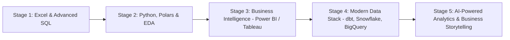
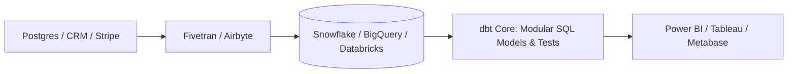

# 📊 Modern Data Analytics Roadmap (2026 - 2027)

> **"Data Analytics in 2026 is no longer just making bar charts; it is about building automated analytics pipelines, mastering dbt & cloud data warehouses, and using AI-augmented tools to drive executive business decisions."**

---

## 📈 Analytics Maturity Curve

---

## 💼 Roles & Responsibilities in Production

### 1. Core Mission
A Data Analyst transforms messy, disparate business data into a single source of truth, building automated executive dashboards and uncovering growth, churn, and operational trends that directly drive company strategy and revenue.

### 2. Day-to-Day Responsibilities
- **Data Modeling & Transformation**: Writing modular, tested SQL queries in **dbt** to build clean Fact and Dimension tables in Snowflake/BigQuery.
- **Executive BI Dashboards**: Designing intuitive, interactive dashboards in Power BI (using advanced DAX) or Tableau with self-serve drill-downs for leadership.
- **Product & Business Metrics**: Calculating vital KPIs (LTV, CAC, Retention Cohorts, MRR expansion/contraction, Funnel conversion rates).
- **Ad-Hoc Exploratory Analysis**: Querying millions of records using Python/Polars to diagnose sudden business dips or anomalous metric spikes.
- **Cross-Functional Stakeholder Alignment**: Translating ambiguous business questions from Marketing, Sales, Product, and Finance into concrete analytical specifications.

### 3. Seniority Expectations
| Level | Scope & Daily Expectations | Key Deliverable |
|-------|----------------------------|-----------------|
| **Junior Data Analyst** | Writes ad-hoc SQL queries, cleans data, and updates existing Power BI reports under guidance. | Accurate SQL query outputs, well-formatted CSV reports, refreshed dashboards. |
| **Mid-Level Data Analyst** | Owns specific business domain dashboards (e.g., Marketing or Growth), builds dbt data models, and identifies metric trends autonomously. | End-to-end star-schema data models, executive dashboards, cohort retention analyses. |
| **Senior / Lead Analyst** | Defines core company KPI definitions, sets up data governance and metric testing standards, leads deep-dive strategic research, and advises C-suite executives. | Company-wide KPI semantic layer, predictive retention models, strategic business cases. |

---

## 🗄️ Stage 1: Advanced SQL Mastery (The Non-Negotiable Core)

SQL is the #1 requested skill in 95% of data analyst job descriptions.

### 1. Complex Querying & Joins
- Multi-table `INNER`, `LEFT`, `RIGHT`, `FULL OUTER`, and `CROSS` joins.
- Handling `NULL` semantics (`COALESCE`, `NULLIF`, `IS DISTINCT FROM`).
- Subqueries, Correlated subqueries, and Common Table Expressions (`WITH` clauses / CTEs).

### 2. Window Functions (Crucial for Interviews)
- Ranking: `ROW_NUMBER()`, `RANK()`, `DENSE_RANK()`, `NTILE()`.
- Value: `LEAD()`, `LAG()` for MoM (Month-over-Month) and YoY retention calculations.
- Aggregation frames: `ROWS BETWEEN 6 PRECEDING AND CURRENT ROW` for rolling 7-day moving averages.

### 3. Data Aggregation & Pivoting
- `GROUP BY`, `HAVING`, `GROUPING SETS`, `ROLLUP`, `CUBE`.
- Conditional aggregation with `CASE WHEN`.
- `PIVOT` and `UNPIVOT` operations.

### 4. Query Performance Tuning
- Reading `EXPLAIN ANALYZE` execution plans.
- Indexing strategies (B-Tree, Hash, Partial indexes).
- Avoiding expensive full-table scans and Cartesian explosions.

---

## 🐍 Stage 2: Python, Pandas & Modern Polars for Analytics

### 1. High-Performance Data Manipulation
- **Pandas 2.0+**: Vectorized operations, `.loc` vs `.iloc`, method chaining, handling missing data (`dropna`, `fillna`), merging, and reshaping.
- **Polars (The 2026 Standard)**: Lightning-fast, multi-threaded Rust-based DataFrame library that processes millions of rows in seconds where Pandas runs out of memory.

### 2. Exploratory Data Analysis (EDA) & Statistics
- Descriptive statistics: Mean, Median, Mode, Variance, Standard Deviation, IQR.
- Correlation analysis: Pearson vs Spearman correlation matrices.
- Hypothesis Testing & A/B Testing: $p$-values, $t$-tests, Chi-square tests, confidence intervals.

### 3. Visual Analytics
- **Seaborn & Matplotlib**: Statistical distributions (histograms, KDE plots, box plots, violin plots).
- **Plotly**: Interactive, drill-down dashboards for web embeds.

---

## 📊 Stage 3: Modern Business Intelligence (Power BI & Tableau)

### 1. Microsoft Power BI
- **Power Query**: Ingestion, unpivoting, merging, cleaning M-code.
- **Data Modeling**: Star Schema (Fact tables vs Dimension tables) — *Crucial: Never use flat single-table models*.
- **DAX (Data Analysis Expressions)**:
  - Calculated Columns vs Measures.
  - `CALCULATE()` (The most powerful DAX function with filter contexts).
  - Time Intelligence functions (`TOTALYTD`, `SAMEPERIODLASTYEAR`, `DATEADD`).

### 2. Tableau Alternative
- Level of Detail (LOD) expressions (`FIXED`, `INCLUDE`, `EXCLUDE`).
- Dual-axis charts, parameters, dashboard actions, storytelling storyboards.

---

## ❄️ Stage 4: Modern Data Stack (Snowflake, BigQuery & dbt)

Modern companies do not do transformations in BI tools; they use ELT (Extract, Load, Transform):

### 1. Cloud Data Warehouses
- **Snowflake**: Virtual warehouses, clustering keys, zero-copy cloning, time travel queries.
- **Google BigQuery**: Partitioning by date, clustering by ID, cost-conscious scanning.

### 2. dbt (data build tool)
- Writing modular SQL transformations with Jinja templating.
- Data testing: `unique`, `not_null`, `relationships`, and custom schema tests.
- Documentation generation and automated data lineage DAGs.

---

## 🤖 Stage 5: AI-Augmented Analytics & Product Metrics

### 1. Product & Business KPIs
- **SaaS & Subscription**: MRR/ARR, Churn Rate, LTV (Customer Lifetime Value), CAC (Customer Acquisition Cost), Net Retention Rate (NRR).
- **E-Commerce**: Conversion Funnels, Cart Abandonment, Average Order Value (AOV), Repeat Purchase Rate.
- **Cohort Analysis**: User retention matrices over 30/60/90 days.

### 2. AI in Modern Analytics (2026 Shift)
- Using LLM-assisted SQL generators and validation agents.
- Automated anomaly detection on business metrics with Python (`Prophet`, `statsmodels`).
- Executive narrative automation (turning dashboard metric spikes into automated natural-language bullet points).

---

## 💼 Production Portfolio Projects

1. **End-to-End E-Commerce Customer Retention & Churn Cohort Engine**:
   - Ingest raw transactions into Snowflake.
   - Transform and model star schema with **dbt** (Fact Sales, Dim Customers, Dim Products).
   - Interactive Power BI dashboard with DAX time-intelligence and 30-day cohort retention heatmap.
2. **Subscription SaaS Revenue & Anomaly Alerting Pipeline**:
   - Python + Polars for data wrangling.
   - Advanced SQL window functions to compute MRR expansion and contraction.
   - Automated Streamlit / Plotly dashboard with statistical anomaly alerts.
