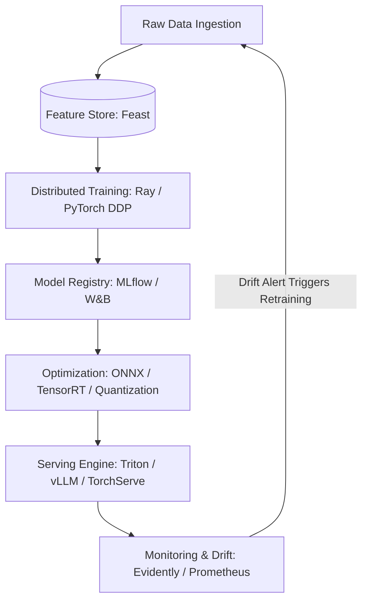

# ⚙️ Machine Learning Engineer (MLE) Roadmap (2026 - 2027)

> **"Data Scientists train models in Jupyter Notebooks. Machine Learning Engineers build the automated, scalable, low-latency production pipelines that serve those models to 50 million concurrent users."**

---

## 🛠️ The Production MLOps Flywheel

---

## 💼 Roles & Responsibilities in Production

### 1. Core Mission
A Machine Learning Engineer (MLE) operationalizes data science prototypes into robust, fault-tolerant, high-throughput production systems, managing everything from automated retraining pipelines to sub-20ms model serving at scale.

### 2. Day-to-Day Responsibilities
- **Production Pipeline Orchestration**: Building automated data and training DAGs using **Dagster** or **Airflow**, integrated with **Feast** feature stores to prevent training-serving skew.
- **Inference Optimization & Acceleration**: Converting PyTorch models into **ONNX** or **TensorRT** formats, applying INT8 quantization and pruning to minimize inference latency and GPU RAM usage.
- **Microservice & Engine Deployment**: Deploying models to Kubernetes using **Triton Inference Server**, **TorchServe**, or **vLLM** with dynamic batching and GPU autoscale policies.
- **Drift Detection & Continuous Monitoring**: Setting up automated alerts for data drift (KS-test / PSI) and concept drift using **Evidently AI** and Prometheus/Grafana to trigger retraining.
- **Distributed Training Infrastructure**: Configuring multi-node multi-GPU training jobs with **Ray Train** and PyTorch Distributed Data Parallel (DDP).

### 3. Seniority Expectations
| Level | Scope & Daily Expectations | Key Deliverable |
|-------|----------------------------|-----------------|
| **Junior MLE** | Packages Python training code into Docker containers, writes unit tests, and implements basic FastAPI model serving endpoints. | Containerized model services, integration tests, benchmark latency reports. |
| **Mid-Level MLE** | Owns automated training pipelines, sets up feature stores, optimizes inference runtimes, and manages model registries. | End-to-end MLOps pipelines in MLflow, Triton serving configs, automated drift alerts. |
| **Senior / Staff MLE** | Designs multi-cluster distributed training systems, architects real-time low-latency recommendation/inference engines, cuts cloud GPU costs by 40%+, and establishes MLOps standards. | Enterprise ML platform architecture, custom inference kernels, zero-downtime canary deployment systems. |

---

## 💻 Stage 1: Software Engineering & Systems Foundations

An MLE is primarily a Software Engineer with specialized ML systems expertise:

### 1. Production Code Standards
- Packaging Python code into clean, modular packages (`pyproject.toml`).
- Formatting & Linting: `ruff` (super-fast linter/formatter).
- Static Type Checking: `mypy` or `pyright`.
- Unit & Integration Testing: `pytest`, mocking data sources, test coverage.

### 2. Containers & Cloud Infrastructure
- **Docker**: Writing lightweight multi-stage Dockerfiles for ML environments with CUDA support (`nvidia/cuda` base images).
- **Kubernetes (K8s)**: Pods, Deployments, Services, Horizontal Pod Autoscaling (HPA), GPU resource requests (`nvidia.com/gpu`).

---

## 🧬 Stage 2: Feature Stores & Data Pipelines

### 1. Pipeline Orchestration
- **Dagster** or **Apache Airflow**: Defining Directed Acyclic Graphs (DAGs) for automated data ingestion and preprocessing.
- **Prefect**: Modern pure-Python workflow coordination.

### 2. Feature Stores (Feast / Hopsworks)
- **Offline Store (Batch Training)**: Parquet / Snowflake / BigQuery for historical feature retrieval.
- **Online Store (Low-Latency Inference)**: Redis / DynamoDB with sub-10ms point lookups.
- **Point-in-Time Correctness**: Eliminating training-serving skew and temporal data leakage.

---

## 🔬 Stage 3: MLOps, Experiment Tracking & Versioning

### 1. Experiment Tracking & Model Registry
- **MLflow**:
  - `mlflow.log_params()`, `mlflow.log_metrics()`, `mlflow.log_artifacts()`.
  - MLflow Model Registry: Transitioning stages (`Staging` -> `Production` -> `Archived`).
- **Weights & Biases (W&B)**: Collaborative team tracking, hyperparameter sweeps.

### 2. Data & Model Version Control
- **DVC (Data Version Control)**: Git for gigabyte/terabyte datasets and model weights stored in S3/GCS.

---

## 🚀 Stage 4: High-Performance Model Serving & Inference Optimization

Serving models in production requires optimizing memory and latency:

### 1. Model Serialization & Cross-Platform Compilers
- **ONNX (Open Neural Network Exchange)**: Exporting PyTorch/Scikit-learn models to hardware-agnostic ONNX runtime.
- **NVIDIA TensorRT**: Layer fusion, kernel tuning, and hardware-specific acceleration on NVIDIA GPUs.

### 2. Quantization & Compression
- **FP16 / BF16**: Half-precision floating-point inference.
- **INT8 Quantization**: Post-Training Quantization (PTQ) and Quantization-Aware Training (QAT).
- **Pruning & Knowledge Distillation**: Shrinking large models into efficient student networks.

### 3. Dedicated Serving Engines
- **NVIDIA Triton Inference Server**: Concurrent model execution, dynamic batching, CPU/GPU routing, gRPC interfaces.
- **vLLM / TGI**: High-throughput LLM serving with PagedAttention and continuous batching.
- **TorchServe / FastAPI**: Lightweight microservice serving for tree models and embeddings.

---

## ⚡ Stage 5: Distributed Training & Large-Scale Systems

### 1. Distributed Training Strategies
- **Data Parallelism (DDP)**: Replicating model weights across multiple GPUs with synchronized gradients.
- **Fully Sharded Data Parallel (FSDP)**: Sharding parameters, gradients, and optimizer states across nodes (PyTorch native).
- **DeepSpeed / Megatron-LM**: Zero Redundancy Optimizer (ZeRO Stages 1, 2, 3) for training massive models.

### 2. Distributed Compute Frameworks
- **Ray**:
  - `Ray Core`: Actor and task primitives.
  - `Ray Train`: Elastic distributed model training.
  - `Ray Serve`: Scalable, framework-agnostic microservice deployment.

---

## 📉 Stage 6: Observability, Drift & Continuous Deployment (CD4ML)

### 1. Drift & Quality Monitoring
- **Data Drift (Covariate Shift)**: Input distributions change over time ($P(X)$ changes). Measured via Kolmogorov-Smirnov test or Population Stability Index (PSI).
- **Concept Drift**: The relationship between features and labels changes ($P(Y \mid X)$ changes).
- Monitoring Tools: **Evidently AI**, **WhyLogs**, Prometheus + Grafana dashboards.

### 2. Production Deployment Strategies
- **Canary Deployments**: Routing 5% of production traffic to the new model candidate.
- **Shadow Deployments**: Sending 100% of real traffic to both active and candidate models, but only returning the active model's response to the user while evaluating candidate latency and predictions.
- **A/B Testing Infrastructure**: Multi-armed bandits for dynamic traffic routing.

---

## 🏆 Standout MLE Capstone Projects

1. **Automated End-to-End MLOps Pipeline for Credit Default Prediction**:
   - Orchestrated with **Dagster**.
   - Feature store powered by **Feast** (Snowflake for offline, Redis for online).
   - LightGBM model tracked in **MLflow**, exported to **ONNX**.
   - Served via **FastAPI** on Kubernetes with **Evidently AI** monitoring for statistical data drift.
2. **High-Throughput Distributed Embedding & Recommendation Serving Engine**:
   - Two-tower neural recommendation model in PyTorch 2.x.
   - Accelerated with **TensorRT** and served via **Triton Inference Server** with gRPC.
   - P99 inference latency $< 15$ ms under 5,000 requests/sec load test.
