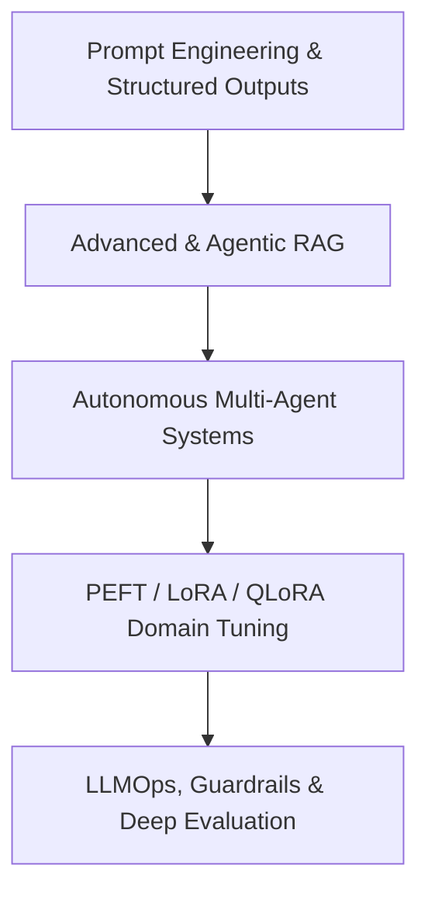
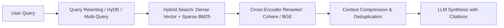

# 🧠 AI Engineer & Generative AI Roadmap (2026 - 2027)

> **"The AI Engineer is the fastest-evolving engineering role in history. In 2026, building a simple wrapper around an LLM API is dead. The frontier belongs to engineers who build Agentic Workflows, Advanced GraphRAG, Fine-Tuned Domain Adapters, and Provably Safe Evaluation Systems."**

---

## 🚀 The AI Engineer Architectural Spectrum

---

## 💼 Roles & Responsibilities in Production

### 1. Core Mission
An AI & Generative AI Engineer designs, builds, and deploys intelligent software systems powered by foundation models. They move beyond basic prompt wrappers to engineer autonomous agent state machines, hybrid GraphRAG search, fine-tuned domain adapters, and provably reliable LLM guardrail pipelines.

### 2. Day-to-Day Responsibilities
- **Multi-Agent Workflow Engineering**: Building cyclical, stateful agent graphs using **LangGraph** or **CrewAI** equipped with database query tools, code execution sandboxes, and human-in-the-loop approval checkpoints.
- **Advanced RAG Architectures**: Engineering multi-stage retrieval pipelines combining semantic embeddings, BM25 keyword matching, knowledge graphs (Neo4j), and cross-encoder rerankers (Cohere Rerank).
- **Fine-Tuning & Model Alignment**: Adapting open-weights models (Llama 3.x, Mistral) on proprietary enterprise data using **QLoRA** and **Unsloth**, followed by DPO preference alignment.
- **Evaluation & Hallucination Mitigation**: Designing automated test suites with **DeepEval** and **Ragas** measuring faithfulness, context precision, and hallucination rates before deployment.
- **LLMOps & Cost Optimization**: Implementing semantic caching with Redis, managing token quotas, monitoring prompt injection vulnerabilities with **NeMo Guardrails**, and tracing request trees in **Langfuse**.

### 3. Seniority Expectations
| Level | Scope & Daily Expectations | Key Deliverable |
|-------|----------------------------|-----------------|
| **Junior AI Engineer** | Crafts structured prompts with Instructor/Pydantic, builds naive RAG pipelines, and writes unit tests for AI endpoints. | Validated Pydantic output schemas, basic vector search endpoints, evaluation test sets. |
| **Mid-Level AI Engineer** | Builds production agent graphs, implements hybrid RAG with reranking, sets up vector databases, and integrates LLMOps tracing. | Robust multi-agent workflows, production RAG services with citations, DeepEval benchmark reports. |
| **Senior / Staff AI Engineer** | Architectures company-wide AI platform, selects when to use RAG vs Fine-Tuning vs Small Specialized Models, reduces enterprise LLM spend by 50%+, and designs fail-safe guardrail firewalls. | Enterprise Agentic Platform, custom fine-tuned domain models, automated red-teaming pipelines, LLM security standards. |

---

## 🧬 Stage 1: Foundation Models & Transformer Mechanics

To debug LLM quirks in production, you must understand how they operate under the hood:

### 1. Transformer Architecture Fundamentals
- **Decoder-Only Architectures**: GPT, Claude, Gemini, Llama 3.x, Mistral, DeepSeek.
- **Attention Mechanics**: Query, Key, Value ($Q, K, V$), Multi-Head Attention, Scaled Dot-Product Attention, Grouped-Query Attention (GQA).
- **Inference Optimization**: **KV Cache** (Key-Value Cache) and PagedAttention (why time-to-first-token vs generation throughput differ).
- **Tokenization**: Byte-Pair Encoding (BPE), SentencePiece. Understanding token limits, cost calculations, and multimodality (image/audio tokens).
- **Sampling Parameters**: Temperature, Top-P (nucleus), Top-K, Frequency/Presence penalties, Repetition penalty.

---

## 🎯 Stage 2: Structured Outputs & Reliable Execution

Enterprise systems cannot tolerate loose, conversational text; they require deterministic JSON:

### 1. Structured Output Extraction
- **Instructor**: Using Pydantic models to enforce strict schema adherence across OpenAI, Anthropic, Gemini, and local models.
- **Outlines / JSONformer**: Constrained decoding at the token-probability level to guarantee 100% syntactic validity.
- Handling schema retries and self-correction loops.

### 2. Advanced Prompt Engineering
- Few-shot in-context learning with representative positive and negative examples.
- **Chain-of-Thought (CoT)** & Least-to-Most prompting.
- **ReAct Pattern (Reason + Act)**: Interleaving thought steps with external tool execution.

---

## 📚 Stage 3: Advanced & Agentic RAG (Retrieval-Augmented Generation)

Basic vector search with naïve chunking fails 40% of the time in production. Modern RAG uses multi-stage retrieval:

### 1. Ingestion & Chunking Strategies
- Recursive character splitting with contextual overlap.
- **Semantic Chunking**: Splitting text based on embedding cosine similarity changes between sentences.
- Multi-modal ingestion (parsing tables, diagrams, and scanned PDFs using tools like **Unstructured** or **LlamaParse**).

### 2. Hybrid Retrieval & Reranking
- **Dense Retrieval**: Embedding models (`text-embedding-3-large`, BGE-M3, Cohere v3).
- **Sparse Keyword Search**: BM25 / SPLADE for exact keyword and acronym lookups.
- **Cross-Encoder Rerankers** (**Cohere Rerank**, **BGE-Reranker-Large**): Scores top 50 retrieved chunks to pick the true top 5 relevant passages.

### 3. Advanced RAG Paradigms
- **HyDE (Hypothetical Document Embeddings)**: LLM generates a hypothetical answer, then uses that answer to search vector space.
- **Corrective RAG (CRAG)**: Evaluator checks if retrieved chunks answer the query; if not, triggers web search fallback.
- **GraphRAG**: Combining Knowledge Graphs (Neo4j) with vector embeddings to connect cross-document relationships.

---

## 🤖 Stage 4: Autonomous Agents & Multi-Agent Workflows

Modern AI applications are not static pipelines; they are autonomous graphs that can loop, branch, retry, and collaborate:

### 1. Agentic Frameworks (2026 Industry Standards)
- **LangGraph**: The gold standard for production state machines. Cycles, conditional branching, human-in-the-loop breakpoints, and state persistence.
- **CrewAI**: Role-playing autonomous multi-agent teams (e.g., Researcher + Writer + Fact-Checker).
- **Semantic Kernel** / **AutoGen**.

### 2. Agent Tools & Memory Architecture
- **Tool Calling**: Giving models access to SQL execution, web scrapers, REST APIs, and code sandboxes (e.g., E2B).
- **Memory Systems**:
  - Short-term conversational buffer.
  - Long-term persistent semantic memory (**Mem0** or custom vector graph memory).

---

## 🔬 Stage 5: Fine-Tuning & Model Adaptation (PEFT / LoRA)

When to use what:
- **Prompt Engineering**: $0$ effort, fast testing, baseline.
- **RAG**: Need fresh, private, external, or dynamic knowledge.
- **Fine-Tuning**: Need specialized tone, domain style, strict output formatting, or learning a non-English language dialect.

### 1. Parameter-Efficient Fine-Tuning (PEFT)
- **LoRA (Low-Rank Adaptation)**: Freezing original base weights and training low-rank decomposition matrices $\Delta W = A \times B$.
- **QLoRA**: 4-bit NormalFloat (NF4) quantization of base model with 16-bit LoRA adapters (fine-tune a 70B model on a single consumer GPU).
- Modern Fine-Tuning Toolkits: **Unsloth** (5x faster, 80% less VRAM), **Axolotl**, Hugging Face TRL (`SFTTrainer`).

### 2. Preference Alignment
- **DPO (Direct Preference Optimization)**: Lightweight replacement for complex RLHF (Reinforcement Learning from Human Feedback).
- Aligning models using chosen vs rejected dataset pairs.

---

## 🛡️ Stage 6: Evaluation, Guardrails & LLMOps

You cannot ship an AI system to production without continuous evaluation:

### 1. Automated RAG & LLM Evaluation Frameworks
- **Ragas & DeepEval**:
  - Faithfulness (Did the model hallucinate beyond retrieved context?).
  - Answer Relevancy (Did it answer what the user asked?).
  - Context Precision & Context Recall.
- **LLM-as-a-Judge**: Using frontier models to evaluate lower-cost model runs systematically.

### 2. Safety, Red-Teaming & Guardrails
- **NeMo Guardrails** (NVIDIA) and **Llama Guard**: Topical moderation, PII redaction, jailbreak prevention, and output filtering.
- Prompt injection defenses.

### 3. Observability & Tracing
- **Langfuse** (Open-source) or **Arize Phoenix**: Full distributed tracing of every prompt, token count, latency, and cost per request.
- Semantic caching with Redis to cut LLM API bills by up to 40%.

---

## 🏆 Production Capstone Projects for AI Engineers

1. **Enterprise Self-Reflective GraphRAG & Research Agent**:
   - Built with **LangGraph** + **Neo4j** + **Qdrant** + **Claude 3.5 Sonnet**.
   - Accepts complex financial questions, generates multi-hop query plans, cross-checks balance sheets against SEC filings, evaluates factual faithfulness with DeepEval, and streams findings with interactive citations.
2. **Domain-Adapted Medical/Legal Copilot with QLoRA & Safeguards**:
   - Base model: Llama 3.1 8B fine-tuned with **Unsloth** on specialized legal/medical dialogues using QLoRA.
   - Evaluated with DPO for tone alignment.
   - Wrapped in **FastAPI** with **NeMo Guardrails** preventing hallucinated prescriptions/legal counsel.
   - Traced with **Langfuse** for latency and cost analytics.
