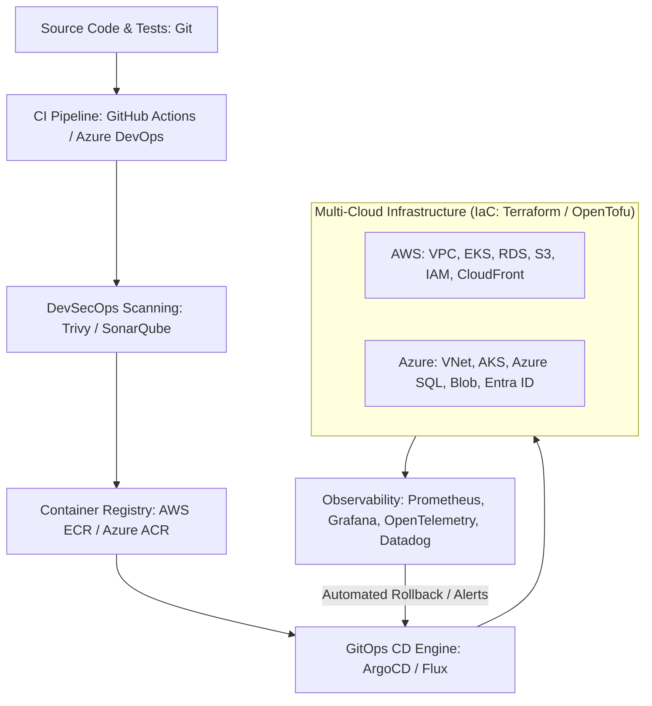

# ☁️ DevOps & Cloud Engineer Roadmap: AWS & Azure (2026 - 2027)

> **"DevOps in 2026 is no longer just writing bash scripts or manually provisioning VMs. It is about GitOps, immutable Infrastructure as Code (Terraform), Kubernetes cluster orchestration across AWS and Azure, automated DevSecOps gates, and deep OpenTelemetry observability."**

---

## 🗺️ The Modern DevOps & Cloud Architecture

---

## 💼 Roles & Responsibilities in Production

### 1. Core Mission
A DevOps & Cloud Engineer designs, automates, and maintains the cloud infrastructure and delivery pipelines that allow engineering teams to deploy software rapidly, reliably, and securely. They own platform stability, multi-cloud scalability, disaster recovery, and infrastructure cost optimization (FinOps).

### 2. Day-to-Day Responsibilities
- **Infrastructure as Code (IaC)**: Writing modular, reusable **Terraform** or **OpenTofu** code to provision and version AWS and Azure cloud topologies.
- **Kubernetes Cluster Operations**: Managing and scaling **EKS** (AWS) and **AKS** (Azure), writing Helm charts, configuring node pools, cluster autoscalers (Karpenter), and ingress controllers.
- **CI/CD Pipeline Engineering**: Building continuous integration and deployment pipelines using **GitHub Actions**, **GitLab CI**, or **Azure DevOps Pipelines** with automated linting, testing, and container builds.
- **GitOps Deployment Automation**: Enforcing declarative continuous delivery using **ArgoCD** or **Flux** to synchronize cluster state with Git repositories.
- **Observability & SRE Incident Management**: Configuring **Prometheus**, **Grafana**, and **OpenTelemetry** for distributed tracing, setting up SLI/SLO alerts, and participating in on-call incident triage and post-mortems.
- **Cloud Security & Compliance (DevSecOps)**: Enforcing IAM Least Privilege, managing secrets with **HashiCorp Vault** or AWS/Azure Key Vaults, and vulnerability scanning with **Trivy**.

### 3. Seniority Expectations
| Level | Scope & Daily Expectations | Key Deliverables |
|-------|----------------------------|------------------|
| **Junior DevOps Engineer** | Maintains existing CI/CD pipelines, writes basic Dockerfiles, creates simple Terraform modules, and monitors server health. | Docker images, automated test scripts in GitHub Actions, basic VM/storage Terraform files. |
| **Mid-Level Cloud/DevOps Eng** | Deploys and manages production Kubernetes clusters, provisions complex VPC/VNet networks, writes custom Helm charts, and implements GitOps. | EKS/AKS cluster configurations, ArgoCD deployments, multi-stage CI/CD pipelines, Datadog dashboards. |
| **Senior / Staff SRE / Cloud Architect** | Architectures multi-cloud disaster recovery, enforces enterprise FinOps cost efficiency, leads Zero-Trust security governance, and designs self-healing platforms. | Multi-region cloud architecture, automated disaster recovery failover, custom Kubernetes operators, FinOps cost savings. |

---

## 🐧 Stage 1: Linux, Networking & Scripting Foundations

Production cloud workloads run on Linux. Deep system fundamentals are non-negotiable:

### 1. Linux System Administration
- Shell navigation, permissions (`chmod`, `chown`), process management (`ps`, `top`, `htop`, `kill`).
- System services: `systemd`, unit files, logging with `journalctl`.
- Storage & filesystems: Mounting, disk partitioning (`fdisk`, `lsblk`), checking inode exhaustion (`df -i`, `du -sh`).
- Troubleshooting utilities: `lsof`, `strace`, `curl`, `dig`, `tcpdump`, `netstat`/`ss`.

### 2. Networking & Security Protocols
- The TCP/IP Model & OSI Layers (L4 Transport vs L7 Application).
- DNS resolution flow, Reverse Proxies (Nginx, Envoy, Traefik).
- SSL/TLS handshakes, certificates, Let's Encrypt, and PKI infrastructure.
- Subnetting, CIDR blocks, NAT Gateways, firewalls, and routing tables.

### 3. Modern Automation Scripting
- **Bash Scripting**: Defensive scripting (`set -euo pipefail`), regex processing with `awk`, `sed`, `grep`, and `jq` for JSON manipulation.
- **Python for DevOps**: Writing automation scripts using `boto3` (AWS SDK) and Azure SDK for automated maintenance, backups, and audits.

---

## 🐳 Stage 2: Containers & Kubernetes (EKS & AKS)

### 1. Advanced Containerization (Docker)
- Multi-stage builds for lean production images (under 50 MB with Distroless or Alpine).
- Docker layer caching optimization and `.dockerignore`.
- Container security: Running as non-root user, scanning base images with **Trivy** or **Grype**.

### 2. Kubernetes Core Concepts
- Workloads: Pods, Deployments, ReplicaSets, StatefulSets, DaemonSets, Jobs, CronJobs.
- Networking: ClusterIP, NodePort, LoadBalancer, and **Ingress Controllers** (Nginx Ingress, AWS ALB Controller).
- Config & Storage: ConfigMaps, Secrets, PersistentVolumes (PV), PersistentVolumeClaims (PVC), StorageClasses.
- Package Management: **Helm 3** (Creating charts, `values.yaml`, templates, Helm hooks).

### 3. Production Cluster Management
- Autoscaling: Horizontal Pod Autoscaler (HPA), Vertical Pod Autoscaler (VPA), and modern node autoscaling with **Karpenter** on AWS.
- Service Mesh: **Istio** or **Linkerd** (mTLS encryption between services, traffic splitting, canary routing).

---

## ☁️ Stage 3: Multi-Cloud Mastery (AWS & Azure Deep Dive)

Modern enterprise organizations rarely rely on a single cloud. You must master both AWS and Microsoft Azure:

### 1. Amazon Web Services (AWS) Deep Dive
- **Compute & Containers**: EC2 (Instance types, Spot instances, Auto Scaling Groups), ECS (Fargate), **AWS EKS**.
- **Networking**: VPC (Public/Private subnets, Internet Gateways, NAT Gateways, Transit Gateway, VPC Peering, Route 53, CloudFront CDN).
- **Security & IAM**: IAM Policies (Condition blocks, Least Privilege), Roles, Instance Profiles, AWS KMS, AWS WAF.
- **Storage & Databases**: S3 (Lifecycle policies, bucket policies, replication), EBS, RDS (PostgreSQL/MySQL Multi-AZ), DynamoDB.
- **Serverless & Integration**: AWS Lambda, API Gateway, SQS, SNS, EventBridge.

### 2. Microsoft Azure Deep Dive
- **Compute & Containers**: Azure Virtual Machines, Virtual Machine Scale Sets (VMSS), Azure Container Instances (ACI), **Azure Kubernetes Service (AKS)**.
- **Networking**: Azure Virtual Networks (VNet), Subnets, Network Security Groups (NSGs), Azure Application Gateway, Azure Front Door, Private Endpoints.
- **Security & Identity**: **Microsoft Entra ID (formerly Azure AD)**, Managed Identities, Role-Based Access Control (RBAC), Azure Key Vault.
- **Storage & Databases**: Azure Blob Storage (Hot/Cool/Archive tiers), Azure SQL Database, Azure Cosmos DB.
- **Serverless & Services**: Azure Functions, Azure Service Bus, Event Grid.

---

## 🏗️ Stage 4: Infrastructure as Code (Terraform & OpenTofu)

Manual cloud configuration via web consoles is forbidden in production:

### 1. Terraform / OpenTofu Core
- Declarative syntax (HCL), Resource blocks, Data sources, Input variables, Output values.
- **State Management**:
  - Remote state storage: AWS S3 + DynamoDB state locking; Azure Blob Storage with blob lease locking.
  - State isolation: Workspaces vs Directory-based environment separation (`environments/dev`, `environments/prod`).
  - Handling state drift: `terraform refresh`, `terraform plan -detailed-exitcode`.

### 2. Enterprise Terraform Patterns
- Building reusable, versioned internal modules.
- **Terragrunt** for DRY (Don't Repeat Yourself) multi-region configurations.
- Static code analysis for IaC: `tflint`, `tfsec`, `checkov` to prevent insecure S3 buckets or public databases before commit.

---

## 🚀 Stage 5: CI/CD, GitOps & DevSecOps

### 1. CI/CD Automation
- **GitHub Actions**: Reusable workflows, matrix strategies, self-hosted runners, OIDC authentication with AWS and Azure (eliminating hardcoded credentials!).
- **Azure DevOps Pipelines**: Multi-stage YAML pipelines, deployment environments, approval gates.

### 2. GitOps (The 2026 Deployment Standard)
- **ArgoCD**: Declarative continuous delivery for Kubernetes.
- ApplicationSets, automated sync policies, self-healing clusters, and rollback on failed health checks.
- Deployment Strategies:
  - **Blue-Green Deployments**: Zero downtime, instant traffic switch.
  - **Canary Releases with Argo Rollouts**: Progressive traffic shifting (10% -> 25% -> 50% -> 100%) paired with Prometheus error-rate analysis.

---

## 📊 Stage 6: Observability, SRE & FinOps

### 1. The Observability Pillar
- **Metrics**: **Prometheus** (PromQL queries, scrape targets) visualized on **Grafana** dashboards.
- **Logs**: **Grafana Loki** or ELK Stack (Elasticsearch, Logstash, Kibana) with structured JSON logging.
- **Distributed Tracing**: **OpenTelemetry (OTel)** collectors tracing requests across distributed microservices.

### 2. SRE & Disaster Recovery
- Defining SLIs (Service Level Indicators), SLOs (Service Level Objectives), and Error Budgets.
- Chaos Engineering: Testing resilience by injecting network failures with Chaos Mesh.
- Backup & Recovery: Automated snapshots, Cross-region replication, RTO (Recovery Time Objective) and RPO (Recovery Point Objective) verification.

### 3. Cloud FinOps (Cost Governance)
- Tagging strategies for cost allocation.
- Leveraging Spot / Preemptible instances, Savings Plans, and Reserved Instances.
- Rightsizing compute using Kubecost and AWS Compute Optimizer.

---

## 🏆 Production Capstone Projects for DevOps Engineers

1. **Multi-Region High-Availability Kubernetes Infrastructure (AWS & Azure)**:
   - Automated via **Terraform** (VPC/VNet, EKS/AKS clusters, IAM/Entra ID roles, remote state with S3/DynamoDB).
   - Ingress configured with TLS auto-provisioning via **cert-manager** and external DNS.
   - Deployed with zero-trust networking using private endpoints.
2. **Enterprise GitOps Delivery Pipeline with Canary Rollouts**:
   - Monorepo deployed using **GitHub Actions** (linting, Trivy vulnerability scan, building multi-arch Docker image, pushing to AWS ECR/Azure ACR).
   - Automated deployment via **ArgoCD** and **Argo Rollouts**.
   - Canary analysis querying **Prometheus** for HTTP 5xx error rates; automatically rolls back if errors exceed 0.5%.
