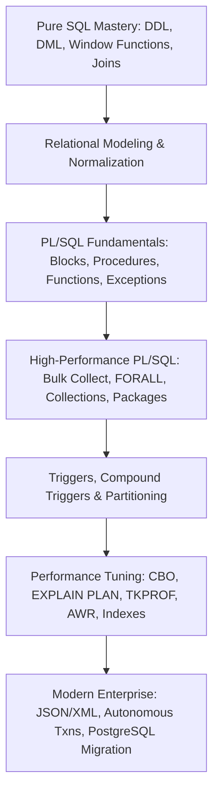

# 🗄️ SQL & PL/SQL Developer Roadmap (2026 - 2027)

> **"In the era of massive enterprise transaction engines (Banking, Fintech, Insurance, Healthcare, Telecom), SQL and PL/SQL developers are the guardians of transactional integrity, high-throughput batch engines, and sub-millisecond database queries."**

---

## 🗺️ The SQL & PL/SQL Architecture Spectrum



---

## 💼 Roles & Responsibilities in Production

### 1. Core Mission
An SQL & PL/SQL Developer designs, implements, and optimizes database schemas, procedural business logic, data transformation routines, and high-volume batch processing jobs that run directly inside relational database management engines (predominantly Oracle Database, PostgreSQL with PL/pgSQL, and Microsoft SQL Server).

### 2. Day-to-Day Responsibilities
- **Database Business Logic Engineering**: Writing robust stored procedures, functions, and packages to encapsulate complex transactional workflows (e.g., credit card settlements, payroll calculations, ledger balancing).
- **High-Performance Bulk Data Processing**: Implementing bulk operations (`BULK COLLECT`, `FORALL`, collections) to process millions of records in minutes rather than hours, eliminating slow row-by-row context switching.
- **Query Performance Tuning**: Reading execution plans, analyzing AWR/ASH reports, tuning SQL queries, creating optimal B-Tree/Bitmap indexes, and eliminating expensive full-table scans.
- **Database Triggers & Data Integrity**: Creating DML, DDL, and compound triggers to enforce audit trails and complex cross-table constraints without causing mutating table errors (`ORA-04091`).
- **Data Warehousing & ETL Support**: Writing high-throughput batch extraction scripts, scheduling database jobs (`DBMS_SCHEDULER`), managing materialized views, and partition pruning.
- **Database Migrations & Modernization**: Writing Flyway/Liquibase migration scripts, exposing database logic via REST (Oracle ORDS), and migrating legacy Oracle PL/SQL packages to modern cloud databases (PostgreSQL PL/pgSQL, Amazon Aurora).

### 3. Seniority Expectations
| Level | Scope & Daily Expectations | Key Deliverables |
|-------|----------------------------|------------------|
| **Junior SQL / PL/SQL Dev** | Writes DDL/DML queries, creates simple views, writes basic stored procedures, and handles bug fixes in existing packages. | Bug-free stored procedures, verified DDL migration scripts, unit-tested SQL queries. |
| **Mid-Level Database Dev** | Owns entire PL/SQL packages, implements bulk data batch engines, configures table partitioning, and resolves execution plan performance bottlenecks. | Complete PL/SQL packages, automated batch processing jobs, tuned execution plans with index recommendations. |
| **Senior Database Architect / Tuning Lead** | Diagnoses high-load production deadlocks, tunes database instance memory/I/O parameters, leads schema refactoring for petabyte-scale databases, and designs migration strategies. | Enterprise database schemas, disaster recovery transaction blueprints, comprehensive AWR performance audits, Oracle-to-PostgreSQL migration frameworks. |

---

## 🏛️ Stage 1: Advanced Relational Modeling & Pure SQL

Before writing procedural logic, you must master the declarative relational engine:

### 1. Database Normalization & Schema Design
- Normal Forms: 1NF, 2NF, 3NF, Boyce-Codd Normal Form (BCNF).
- Understanding when and how to **denormalize** for analytical read performance.
- Integrity Constraints: `PRIMARY KEY`, `FOREIGN KEY` (Cascading deletes/updates), `UNIQUE`, `CHECK`, `NOT NULL`.

### 2. Advanced SQL Operations
- Joins: `INNER`, `LEFT OUTER`, `RIGHT OUTER`, `FULL OUTER`, `CROSS JOIN`, `NATURAL JOIN`, and Self-Joins.
- Set Operators: `UNION`, `UNION ALL` (performance difference), `INTERSECT`, `MINUS` / `EXCEPT`.
- Correlated Subqueries vs Non-Correlated Subqueries.
- The `MERGE` Statement (`UPSERT`): Inserting or updating target tables in a single atomic SQL execution.

### 3. SQL Analytic & Window Functions
- Ranking: `ROW_NUMBER()`, `RANK()`, `DENSE_RANK()`, `NTILE()`.
- Offset & Navigation: `LEAD()`, `LAG()`, `FIRST_VALUE()`, `LAST_VALUE()`.
- Aggregate Windows: Rolling 30-day sums and averages using `ROWS BETWEEN` and `RANGE BETWEEN`.
- Pivot & Unpivot queries for multi-dimensional reporting.

---

## ⚙️ Stage 2: Core PL/SQL Architecture & Constructs

### 1. PL/SQL Engine Architecture
- Understanding the boundary between the **SQL Engine** and the **PL/SQL Engine** (and the cost of context switching).
- Anonymous blocks structure (`DECLARE`, `BEGIN`, `EXCEPTION`, `END;`).
- Anchored data types: `%TYPE` (inheriting column type) and `%ROWTYPE` (inheriting record structure).

### 2. Control Structures & Records
- Conditional logic: `IF-THEN-ELSIF-ELSE`, `CASE` statements and expressions.
- Loops: Simple `LOOP`, `WHILE` loop, Numeric `FOR` loop, Cursor `FOR` loop.
- PL/SQL Records: Programmer-defined records and table-based records.

### 3. Exception Handling (Mission-Critical for Financial Systems)
- Predefined exceptions: `NO_DATA_FOUND`, `TOO_MANY_ROWS`, `ZERO_DIVIDE`, `DUP_VAL_ON_INDEX`.
- Non-predefined exceptions: Associating Oracle error numbers (`ORA-XXXXX`) using `PRAGMA EXCEPTION_INIT`.
- User-defined exceptions: Declaring, raising (`RAISE`), and handling custom business errors.
- `RAISE_APPLICATION_ERROR(-20001, 'Custom Error Message')` for passing errors to client applications.
- Built-in diagnostics: `SQLCODE`, `SQLERRM`, `DBMS_UTILITY.FORMAT_ERROR_BACKTRACE`.

---

## 📦 Stage 3: Modular Programming (Procedures, Functions & Packages)

### 1. Stored Procedures & Functions
- Parameter modes: `IN`, `OUT`, `IN OUT`.
- The `NOCOPY` compiler hint for pass-by-reference optimization of large data structures.
- Stored Functions: Purity levels, writing deterministic functions (`DETERMINISTIC`), and calling functions within SQL queries.

### 2. PL/SQL Packages (Enterprise Encapsulation)
- Why packages are mandatory in production:
  - Separation of interface (**Package Specification**) and implementation (**Package Body**).
  - Information hiding (private vs public functions and variables).
  - Persistent state in package variables across sessions.
  - Better performance (entire package is loaded into shared memory upon first call).
- Subprogram Overloading: Defining multiple functions with the same name but different signatures.
- Forward Declarations for mutually dependent internal procedures.

---

## ⚡ Stage 4: High-Performance Cursors & Bulk Processing

Row-by-row processing (slow-by-slow) will get you rejected from senior database engineering roles. You must master set-based bulk operations:

### 1. Cursors In-Depth
- Implicit Cursors: `SQL%FOUND`, `SQL%NOTFOUND`, `SQL%ROWCOUNT`.
- Explicit Cursors: `OPEN`, `FETCH`, `CLOSE`, `cursor%ISOPEN`.
- Parameterized Cursors and `FOR UPDATE` / `WHERE CURRENT OF` for row-level locking.
- Dynamic `REF CURSOR` (Strong vs Weak) for returning result sets to Java/Python backends.

### 2. PL/SQL Collections
- **Associative Arrays (Index-by Tables)**: In-memory key-value pairs indexed by integer or string.
- **Nested Tables**: Unbounded collections that can be stored as database columns.
- **VARRAYs (Variable-Size Arrays)**: Bounded arrays with fixed upper limit.
- Collection Methods: `.COUNT`, `.FIRST`, `.LAST`, `.PRIOR`, `.NEXT`, `.EXISTS`, `.EXTEND`, `.TRIM`, `.DELETE`.

### 3. Bulk Processing: BULK COLLECT & FORALL
The single most critical performance optimization in PL/SQL:
```sql
-- High-Performance Bulk Batch Processing Pattern
DECLARE
    TYPE t_emp_list IS TABLE OF employees%ROWTYPE;
    l_emps t_emp_list;
    CURSOR c_emp IS SELECT * FROM employees WHERE status = 'PENDING';
BEGIN
    OPEN c_emp;
    LOOP
        -- Fetch in batches of 1,000 to balance memory and speed
        FETCH c_emp BULK COLLECT INTO l_emps LIMIT 1000;
        EXIT WHEN l_emps.COUNT = 0;
        
        -- FORALL executes SQL in a single context switch!
        FORALL i IN 1..l_emps.COUNT SAVE EXCEPTIONS
            UPDATE employees 
            SET processed_date = SYSDATE, status = 'PROCESSED'
            WHERE employee_id = l_emps(i).employee_id;
    END LOOP;
    CLOSE c_emp;
    COMMIT;
EXCEPTION
    WHEN OTHERS THEN
        -- Handle individual row failures using SQL%BULK_EXCEPTIONS
        ROLLBACK;
        RAISE;
END;
/
```
- **Context Switch Elimination**: Moving millions of rows between the PL/SQL engine and the SQL engine in one roundtrip.
- **Error Handling with `SAVE EXCEPTIONS`**: Ensuring valid rows succeed even if row #452 encounters an integrity violation.

---

## 🛡️ Stage 5: Triggers, Materialized Views & Table Partitioning

### 1. Database Triggers
- Trigger Types: Before vs After, Row-Level (`FOR EACH ROW`) vs Statement-Level.
- Pseudo-records: `:OLD.column_name` and `:NEW.column_name`.
- Special Triggers: `INSTEAD OF` triggers for updatable complex views; DDL & Database Event triggers (Logon, Shutdown, DDL audit).
- **Eliminating the Mutating Table Error (`ORA-04091`)**: Using modern **Compound Triggers** to share state between statement and row phases cleanly.

### 2. Materialized Views & Refresh Strategies
- Materialized Views vs Standard Views: Physical caching of query results on disk.
- Refresh types: Complete Refresh, Fast Refresh (using Materialized View Logs `MLOG$`), Refresh on Demand vs Refresh on Commit.
- Query Rewrite optimization by the Cost-Based Optimizer.

### 3. Table Partitioning Strategies (Scale to Billions of Rows)
- **Range Partitioning**: By transaction date or year (e.g., partitioning financial records by month).
- **List Partitioning**: By geographical region or status code.
- **Hash Partitioning**: Distributing data evenly across disks to eliminate I/O hotspots.
- **Composite Partitioning**: Range-Hash or Range-List.
- **Partition Pruning**: The database engine automatically skips 95% of partitions during queries.

---

## 🔍 Stage 6: Database Performance Tuning & Diagnostics

The capability that commands the highest compensation for database engineers:

### 1. The Cost-Based Optimizer (CBO)
- How the optimizer selects execution plans: Cost, Cardinality, I/O, CPU estimates.
- Object Statistics: Gathering schema statistics using `DBMS_STATS.GATHER_TABLE_STATS`.
- Dynamic Sampling and Histograms (Frequency vs Height-Balanced histograms for skewed data).

### 2. Execution Plan Interpretation & Tools
- **`EXPLAIN PLAN FOR`**: Reading execution plans from `PLAN_TABLE` using `DBMS_XPLAN.DISPLAY`.
- Analyzing access paths: Full Table Scan (FTS), Index Unique Scan, Index Range Scan, Index Fast Full Scan, Index Skip Scan.
- Join algorithms: Nested Loops (small inner tables), Hash Join (large unsorted sets), Sort-Merge Join.
- **AUTOTRACE** and **TKPROF**: Profiling CPU time, elapsed time, physical disk reads, and buffer gets.
- **AWR (Automatic Workload Repository) & ASH (Active Session History)**: Diagnosing top wait events (`db file sequential read`, `enq: TX - row lock contention`, `latch: cache buffers chains`).

### 3. Advanced Indexing Strategies
- B-Tree Indexes vs Bitmap Indexes (for low-cardinality read-heavy analytics).
- Function-Based Indexes (e.g., `CREATE INDEX idx_upper_email ON users(UPPER(email))`).
- Composite Indexes: Column order principles (Leading column matching filter predicates).
- Invisible and Unusable indexes for zero-downtime maintenance.

---

## 🌐 Stage 7: Modern Enterprise Integration & Migrations

Relational databases in 2026 are modern, connected, and multi-model:

### 1. JSON & Semi-Structured Data in SQL
- Native JSON columns (`JSON_OBJECT`, `JSON_ARRAY`, `JSON_VALUE`, `JSON_QUERY`).
- JSON Relational Duality Views (mapping relational tables directly as JSON documents).

### 2. Autonomous Transactions & Inter-Database Links
- `PRAGMA AUTONOMOUS_TRANSACTION`: Writing audit logs or error records that commit independently even if the parent transaction rolls back!
- Database Links (`DBLINK`): Cross-database distributed transactions and two-phase commits (2PC).

### 3. Schema Versioning & Cloud Database Migration
- **Flyway** and **Liquibase**: Managing repeatable SQL scripts and schema changelogs in Git repositories.
- **Oracle-to-PostgreSQL Migration Patterns**:
  - Translating Oracle packages into PostgreSQL schemas and schemas-based functions.
  - Converting `NUMBER` to `NUMERIC`/`BIGINT`, `VARCHAR2` to `VARCHAR`.
  - Translating `BULK COLLECT` patterns to set-based PostgreSQL SQL or array unnesting.
  - Re-writing autonomous transactions with background workers or `dblink`.

---

## 🏆 Production Capstone Projects for SQL & PL/SQL Developers

1. **High-Throughput Core Banking Batch Settlement Engine**:
   - Built with Oracle PL/SQL packages.
   - Ingests and reconciles 5 million daily credit/debit transaction records using `BULK COLLECT` and `FORALL` with `LIMIT 5000`.
   - Uses `SAVE EXCEPTIONS` to isolate rejected accounts into an audit error log via `PRAGMA AUTONOMOUS_TRANSACTION`.
   - Tuned execution plan executing in under 3 minutes with composite range partitioning and partition pruning.
2. **Enterprise Inventory & Order Processing System with Compound Triggers**:
   - Manages warehouse stock deductions and invoice generation across multi-tier schemas.
   - Uses compound triggers to update inventory tallies without encountering `ORA-04091` mutating table errors.
   - Includes Materialized Views with Fast Refresh on Commit for real-time executive revenue summaries.
