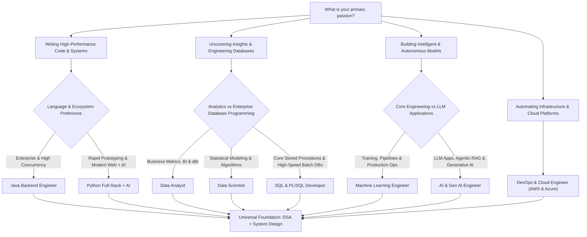

# 🗺️ Master Tech Career Roadmap (2026 - 2027 Edition)

Welcome to the definitive, industry-aligned engineering roadmap collection. Designed for the modern tech landscape where **AI integration, cloud-native scalability, and strong fundamental problem-solving (DSA + System Design)** are standard baseline requirements across all disciplines.

---

## 📚 Roadmap Directory

Each roadmap is self-contained in its own dedicated Markdown guide, featuring step-by-step phases, modern tech stacks, hands-on production projects, and interview preparation blueprints:

| # | Roadmap Document | Target Role | Key 2026-2027 Tech Focus |
|---|------------------|-------------|--------------------------|
| 1 | [01_dsa_roadmap.md](./01_dsa_roadmap.md) | **DSA Mastery** (All Roles) | Patterns, Blind 75/150, Time/Space Complexity, Mock Coding |
| 2 | [02_system_design_roadmap.md](./02_system_design_roadmap.md) | **System Design (LLD & HLD)** | Microservices, Event-Driven, Distributed Caching, AI-scale HLD |
| 3 | [03_java_developer_roadmap.md](./03_java_developer_roadmap.md) | **Modern Java Backend Engineer** | Java 21/25+, Spring Boot 3.x, Virtual Threads, Kafka, Cloud Native |
| 4 | [04_python_fullstack_ai_roadmap.md](./04_python_fullstack_ai_roadmap.md) | **Python Full-Stack + AI Engineer** | FastAPI, React/Next.js 15, LangChain/LlamaIndex, Postgres, Vector DBs |
| 5 | [05_data_analytics_roadmap.md](./05_data_analytics_roadmap.md) | **Data Analyst / BI Engineer** | Advanced SQL, Python, Power BI/Tableau, dbt, Snowflake, AI Analytics |
| 6 | [06_data_science_roadmap.md](./06_data_science_roadmap.md) | **Data Scientist** | Math & Stats, ML Algorithms, Deep Learning, Feature Stores, Experimentation |
| 7 | [07_machine_learning_engineer_roadmap.md](./07_machine_learning_engineer_roadmap.md) | **Machine Learning Engineer (MLE)** | Production Pipelines, Triton/vLLM Serving, MLflow, Docker/K8s, Monitoring |
| 8 | [08_genai_ai_engineer_roadmap.md](./08_genai_ai_engineer_roadmap.md) | **AI & Generative AI Engineer** | LLMs, Agentic RAG, LangGraph, CrewAI, LoRA/QLoRA, Evaluation & Safety |
| 9 | [09_devops_cloud_engineer_roadmap.md](./09_devops_cloud_engineer_roadmap.md) | **DevOps & Cloud Engineer** | AWS & Azure, Terraform, K8s (EKS/AKS), GitOps, ArgoCD, Prometheus |
| 10 | [10_sql_plsql_developer_roadmap.md](./10_sql_plsql_developer_roadmap.md) | **SQL & PL/SQL Developer** | Advanced SQL, Oracle PL/SQL, Bulk Collect, CBO Tuning, Partitioning |

---

## 🎯 How to Choose Your Path

---

## ⚡ The Modern 2026-2027 Industry Standard Rules

1. **AI Is a Multiplier, Not a Shortcut**: LLMs help write boilerplate, but interviewers evaluate deep architectural intuition, edge case handling, and ability to debug distributed failures without AI reliance.
2. **DSA is Non-Negotiable**: For Tier-1 Product Companies and high-growth startups, DSA (Patterns, Arrays, Graphs, DP, Trees) remains the first screening round.
3. **System Design is Demanded Earlier**: Even junior-to-mid roles are expected to understand LLD (Clean Code, SOLID, Design Patterns) and basic HLD (Caching, Load Balancing, DB Sharding).
4. **Deploy What You Build**: Employers no longer look at "toy" local notebook scripts. Every project must be containerized (`Docker`), deployed to the cloud, and have automated CI/CD and monitoring.

---

## 👥 Industry Roles & Responsibilities Matrix (2026 - 2027)

To choose the right path, you must understand the exact production expectations, day-to-day duties, deliverables, and cross-functional collaborations for each role:

| Role | Primary Mission | Day-to-Day Responsibilities | Key Deliverables | Cross-Functional Collaborators |
|------|-----------------|-----------------------------|------------------|--------------------------------|
| **Modern Java Developer** | Builds rock-solid, concurrent, high-throughput enterprise backends and transaction processing engines. | • Designs REST/gRPC APIs using Spring Boot 3 & Java 21+. • Implements asynchronous event pipelines with Kafka. • Tunes database queries, indexes, and connection pools. • Debugs memory leaks, GC pauses, and virtual thread contention. | Microservices, Event schemas, DB migration scripts (Flyway), CI/CD pipelines, Testcontainers suites. | Frontend Devs, DevOps/SRE, Product Managers, Security Engineers. |
| **Python Full-Stack + AI** | Builds user-facing, AI-augmented web products from responsive UI down to streaming async backends. | • Develops interactive frontends with Next.js 15 & React 19. • Writes async FastAPI backends with Pydantic schemas. • Integrates LLMs, tool-calling agents, and vector databases. • Sets up background tasks (Celery/ARQ) and WebSocket/SSE streaming. | Full-stack web apps, AI copilot interfaces, Vector retrieval pipelines, API endpoints. | Product Designers (UI/UX), Product Managers, End-Users, Data Engineers. |
| **Data Analyst / BI Engineer** | Translates raw business data into actionable strategic insights, executive dashboards, and metrics. | • Writes advanced SQL queries (window functions, CTEs). • Builds dimensional star-schema models with dbt. • Designs executive dashboards in Power BI or Tableau. • Conducts cohort retention, revenue churn, and funnel analyses. | Power BI/Tableau dashboards, dbt data models, Executive business reviews, Automated metric anomaly alerts. | Operations, Marketing, Finance leaders, Product Managers, Data Engineers. |
| **Data Scientist** | Formulates hypotheses, discovers predictive patterns, and builds statistical/ML experiments to drive product value. | • Explores raw datasets with Python, Polars & Pandas. • Conducts rigorous A/B test power analysis & CUPED variance reduction. • Trains and tunes predictive models (XGBoost, LightGBM, PyTorch). • Explains model predictions using SHAP/LIME for business stakeholders. | Experimentation readouts, Predictive prototypes, Feature importance reports, A/B test guidelines. | Product Managers, Business Analysts, MLEs, Clinical/Domain Specialists. |
| **Machine Learning Engineer (MLE)** | Bridges prototype ML models and large-scale, low-latency, fault-tolerant production infrastructure. | • Builds production training & feature pipelines (Feast, Dagster). • Optimizes models for inference via ONNX, TensorRT, and Quantization. • Deploys high-throughput serving engines (Triton, vLLM, K8s). • Monitors production data drift & concept drift using Evidently AI. | Automated ML pipelines, Triton/FastAPI microservices, Model registries (MLflow), Drift alerts. | Data Scientists, Platform/DevOps Engineers, Software Engineers. |
| **AI & Generative AI Engineer** | Architect of intelligent systems, autonomous agentic workflows, hybrid RAG, and foundation model adaptation. | • Builds multi-agent state machines using LangGraph & CrewAI. • Implements hybrid GraphRAG (Dense + BM25 + Knowledge Graphs). • Fine-tunes domain adapters with QLoRA/Unsloth. • Implements guardrails (NeMo Guardrails), eval suites (DeepEval), and LLM cost tracing. | Agentic workflows, RAG search pipelines, Fine-tuned adapters, Automated LLM eval suites, Guardrail filters. | Full-Stack Devs, Security & Compliance Officers, Product Managers, UX Designers. |
| **DevOps & Cloud Engineer (AWS & Azure)** | Automates cloud infrastructure, manages multi-cloud Kubernetes clusters, and guarantees continuous delivery reliability & security. | • Provisions cloud infrastructure using Terraform/OpenTofu. • Manages AWS EKS and Azure AKS production clusters. • Builds automated CI/CD pipelines (GitHub Actions, Azure DevOps) and GitOps (ArgoCD). • Configures Prometheus, Grafana, and OpenTelemetry monitoring. | Terraform modules, ArgoCD Helm charts, Multi-cloud VPC/VNet topologies, SLO/SLA alert dashboards. | Software Engineers, QA Engineers, Security (SecOps), FinOps, SRE Leads. |
| **SQL & PL/SQL Developer** | Implements mission-critical core database business logic, high-throughput bulk batch routines, and sub-millisecond query execution. | • Writes production PL/SQL packages, stored procedures, and compound triggers. • Optimizes batch routines using `BULK COLLECT` and `FORALL`. • Tunes execution plans using EXPLAIN PLAN, TKPROF, and AWR reports. • Implements table partitioning and manages schema migrations with Flyway. | Enterprise PL/SQL packages, Bulk transaction processing jobs, Tuned execution plans, Partition schemas. | Backend Developers, DBA (Database Administrators), Data Warehouse Leads, System Architects. |

